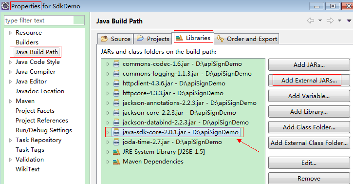
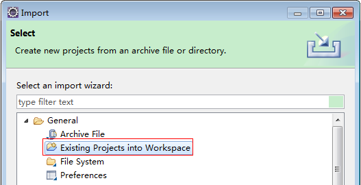
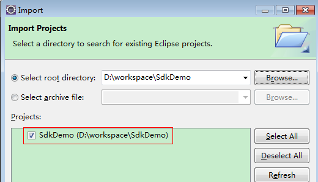
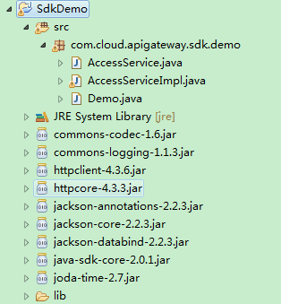

# 管理面API认证鉴权<a name="ges_03_0005"></a>

调用GES管理面API有如下两种认证方式，您可以任选其中一种进行认证鉴权。

-   Token认证：通过Token认证调用请求。
-   AK/SK认证：通过AK\(Access Key ID\)/SK\(Secret Access Key\)加密调用请求。推荐使用AK/SK认证，其安全性比Token认证更高。

## Token认证<a name="section1960316612206"></a>

Token在计算机系统中代表令牌（临时）的意思，拥有Token就代表拥有某种权限。Token认证就是在调用API的时候将Token加到请求消息头，从而通过身份认证，获得操作API的权限。

> **说明：**   
>-   Token的有效期为24小时，需要使用一个Token鉴权时，可以先缓存起来，避免频繁调用。  
>-   GES服务必须通过project的方式来获取token，不支持scope为domain的方式。  

在[管理面API构造请求](管理面API构造请求.md)中以IAM调用[获取用户Token](https://support.huaweicloud.com/api-iam/zh-cn_topic_0057845583.html)接口为例说明了如何调用API。获取Token后，再调用其他接口时，您需要在请求消息头中添加“X-Auth-Token”，其值即为Token。例如Token值为“ABCDEFJ....”，则调用接口时将“X-Auth-Token: ABCDEFJ....”加到请求消息头即可，如下所示。

```
GET https://iam.cn-north-1.myhuaweicloud.com/v3/auth/projects  
Content-Type: application/json 
X-Auth-Token: ABCDEFJ....
```

## AK/SK认证<a name="section1897782517587"></a>

AK/SK认证就是使用AK/SK对请求进行签名，在请求时将签名信息添加到消息头，从而通过身份认证。

> **说明：**   
>AK/SK签名认证方式仅支持消息体大小为12M以内的请求，12M以上的请求请使用Token认证。  

-   AK\(Access Key ID\)：访问密钥ID。与私有访问密钥关联的唯一标识符；访问密钥ID和私有访问密钥一起使用，对请求进行加密签名。
-   SK\(Secret Access Key\)：与访问密钥ID结合使用的密钥，对请求进行加密签名，可标识发送方，并防止请求被修改。

使用AK/SK认证时，您可以基于签名算法使用AK/SK对请求进行签名，也可以使用专门的签名SDK对请求进行签名。详细的签名方法和SDK使用方法请参见[API签名指南](https://support.huaweicloud.com/devg-apisign/api-sign-provide.html)。

> **说明：**   
>签名SDK只提供签名功能，与服务提供的SDK不同，使用时请注意。  

通过使用Access Key ID（AK）/Secret Access Key（SK）加密的方法来验证某个请求发送者身份。当您使用AK/SK认证方式完成认证鉴权时，需要通过请求签名流程获取签名并增加到业务接口请求消息头中。

> **说明：**   
>-   AK\(Access Key ID\)：访问密钥ID。与私有访问密钥关联的唯一标识符。访问密钥ID和私有访问密钥一起使用，对请求进行加密签名。  
>-   SK\(Secret Access Key\)：与访问密钥ID结合使用的密钥，对请求进行加密签名，可标识发送方，并防止请求被修改。  

以下结合一个Demo来介绍如何对一个请求进行签名，并通过HTTP Client发送一个HTTPS请求的过程。

Demo下载地址：[https://github.com/api-gate-way/SdkDemo](https://github.com/api-gate-way/SdkDemo)。

如果您不使用Demo工程，也可以直接下载API网关签名工具在其他工程中引用。请咨询企业管理员获取。

解压下载的压缩包，得到一个jar文件。将解压出来的jar文件引用到依赖路径中。如[图1](#fig1920019142710)所示：

**图 1**  创建Java环境<a name="fig1920019142710"></a>  


1.  生成AK/SK。如果已生成过AK/SK，则可跳过步骤1，找到原来已下载的AK/SK文件，文件名一般为：credentials.csv。
    1.  登录管理控制台。
    2.  单击用户名，在下拉列表中单击“我的凭证”。

        如果下拉列表中没有“我的凭证”，则单击“基本信息”，在基本信息页面中找到“我的凭证”，然后单击进入“我的凭证”管理页面。

    3.  单击“管理访问密钥”。
    4.  单击“新增访问密钥”，进入“新增访问密钥”页面。
    5.  输入当前用户的登录密码。
    6.  通过邮箱或者手机进行验证，输入对应的验证码。

        > **说明：**   
        >在统一身份服务中创建的用户，如果创建时未填写邮箱或者手机号，则只需校验登录密码。  

    7.  单击“确定”，下载访问密钥。

        > **说明：**   
        >为防止访问密钥泄露，建议您将其保存到安全的位置。  


2.  获取示例代码，解压缩。
3.  <a name="li19880182718301"></a>通过import方式将示例工程导入到Eclipse。

    **图 2**  选择已存在的工程<a name="fig63591219193218"></a>  
    

    **图 3**  选择解压后的示例代码<a name="fig511572803310"></a>  
    

    **图 4**  导入成功后工程结构示例<a name="fig24265463417"></a>  
    

4.  对请求进行签名。

    签名方法集成在[3](#li19880182718301)引入的jar文件中。发送请求前，需要对请求内容进行签名，得到的签名结果将作为http头部信息一起发送。

    Demo代码分成三个类进行演示：

    -   AccessService:抽象类，将GET/POST/PUT/DELETE归一成access方法。
    -   Demo:运行入口，模拟用户进行GET/POST/PUT/DELETE请求。
    -   AccessServiceImpl:实现access方法，具体与API网关通信的代码都在access方法中。
        1.  （可选）添加请求消息头。

            请在“AccessServiceImpl.java”文件中找到如下行，取消代码行屏蔽，并且替换成实际的子项目ID和账号ID。

            ```
            //TODO: Add special headers.
             //request.addHeader("X-Project-Id", "xxxxx");
             //request.addHeader("X-Domain-Id", "xxxxx");
            ```

        2.  编辑“Demo.java”文件中的main方法，将以下内容替换为实际获取到的值。

            如果调用其他方法，如POST，PUT，DELETE等，请参考对应注释方法。

            注意替换 region、serviceName、AK/SK 和 URL，Demo中使用了获取VPC的 URL，请替换为您需要的URL，URL中project\_id获取请参见[返回结果](返回结果.md)，Endpoint请向企业管理员获取。

            ```
            //TODO: Replace region with the name of the region in which the service to be accessed is located. 
             private static final String region = ""; 
              
             //TODO: Replace vpc with the name of the service you want to access. For example, ecs, vpc, iam, and elb. 
             private static final String serviceName = ""; 
              
             public static void main(String[] args) throws UnsupportedEncodingException 
             { 
             //TODO: Replace the AK and SK with those obtained on the My Credential page.
             String ak = "ZIRRKMTWP******1WKNKB"; 
             String sk = "Us0mdMNHk******YrRCnW0ecfzl"; 
              
             //TODO: To specify a project ID (multi-project scenarios), add the X-Project-Id header.
             //TODO: To access a global service, such as IAM, DNS, CDN, and TMS, add the X-Domain-Id header to specify an account ID.
             //TODO: To add a header, find "Add special headers" in the AccessServiceImple.java file.
              
             //TODO: Test the API
             String url = "https://{Endpoint}/v1/{project_id}/vpcs"; 
             get(ak, sk, url); 
              
             //TODO: When creating a VPC, replace {project_id} in postUrl with the actual value.
             //String postUrl = "https://serviceEndpoint/v1/{project_id}/cloudservers";
             //String postbody ="{\"vpc\": {\"name\": \"vpc\",\"cidr\": \"192.168.0.0/16\"}}";
             //post(ak, sk, postUrl, postbody);
              
             //TODO: When querying a VPC, replace {project_id} in url with the actual value.
             //String url = "https://serviceEndpoint/v1/{project_id}/vpcs/{vpc_id}";
             //get(ak, sk, url);
              
             //TODO: When updating a VPC, replace {project_id} and {vpc_id} in putUrl with the actual values.
             //String putUrl = "https://serviceEndpoint/v1/{project_id}/vpcs/{vpc_id}";
             //String putbody ="{\"vpc\":{\"name\": \"vpc1\",\"cidr\": \"192.168.0.0/16\"}}";
             //put(ak, sk, putUrl, putbody);
              
             //TODO: When deleting a VPC, replace {project_id} and {vpc_id} in deleteUrl with the actual values.
             //String deleteUrl = "https://serviceEndpoint/v1/{project_id}/vpcs/{vpc_id}";
             //delete(ak, sk, deleteUrl);
             }
            ```

        3.  编译与运行接口调用。

            在左侧“Package Explorer”中找到“Demo.java”，右键选择“Run AS \>Java Application”并单击运行。

            可在控制台查看调用日志。


