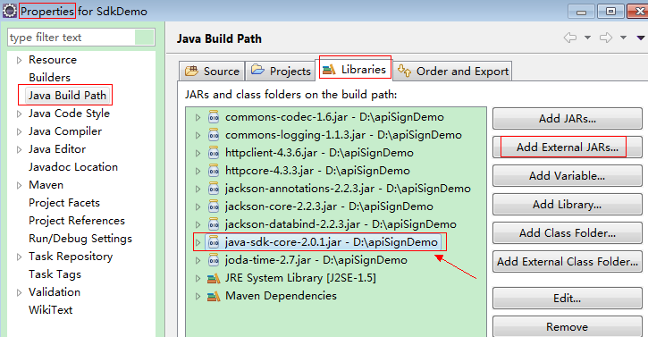

# 获取请求认证<a name="ges_03_0005"></a>

公有云API符合RESTful API设计理论。REST从资源的角度观察整个网络，分布在各处的资源由URI（Uniform Resource Identifier）确定，客户端的应用通过URL（Unified Resource Locator）获取资源。URL的一般格式为：https://Endpoint/uri。其中uri为资源路径，也即API访问的路径。

公有云接口采用HTTPS传输协议，请求/响应报文使用JSON报文，媒体类型表示为application/json。

调用接口有如下两种认证方式，您可以选择其中一种进行认证鉴权。

-   Token认证：通过Token认证通用请求。
-   AK/SK认证：通过AK（Access Key ID）/SK（Secret Access Key\)加密调用请求。推荐使用AK/SK认证，其安全性比Token认证要高。

## Token认证<a name="section7823611184055"></a>

当您使用Token认证方式完成认证鉴权时，需要获取用户Token并在调用接口时增加“X-Auth-Token”到业务接口请求消息头中。

1.  发送“POST https://**_IAM__的Endpoint_**/v3/auth/tokens”，获取IAM的Endpoint及消息体中的区域名称，请参见[地区和终端节点](http://developer.huaweicloud.com/endpoint.html)。

    请求内容示例如下：

    > **说明：**   
    >下面示例代码中的斜体字需要替换为实际内容，详情请参考《统一身份认证服务API参考》。  
    >```  
    >{   
    >  "auth": {   
    >    "identity": {   
    >      "methods": [   
    >        "password"   
    >      ],   
    >      "password": {   
    >        "user": {   
    >          "name": "username",   
    >          "password": "password",   
    >          "domain": {   
    >            "name": "domainname"   
    >          }   
    >        }   
    >      }   
    >    },   
    >    "scope": {   
    >      "project": {   
    >        "name": "cn-north-1" //假设项目名称是"cn-north-1"  
    >      }   
    >    }   
    >  }   
    >}  
    >```  

2.  <a name="li853031184055"></a>获取Token，请参考《统一身份认证服务API参考》的“获取用户Token”章节。请求响应成功后在响应消息头中包含的“X-Subject-Token”的值即为Token值。
3.  调用业务接口，在请求消息头中增加“X-Auth-Token”，“X-Auth-Token”的取值为[2](#li853031184055)中获取的Token。

## AK/SK认证<a name="section17879983184055"></a>

通过使用Access Key ID（AK）/Secret Access Key（SK）加密的方法来验证某个请求发送者身份。当您使用AK/SK认证方式完成认证鉴权时，需要通过请求签名流程获取签名并增加到业务接口请求消息头。

> **说明：**   
>AK\(Access Key ID\)：访问密钥ID。与私有访问密钥关联的唯一标识符；访问密钥ID和私有访问密钥一起使用，对请求进行加密签名。  
>SK\(Secret Access Key\)：与访问密钥ID结合使用的密钥，对请求进行加密签名，可标识发送方，并防止请求被修改。  

1.  生成AK/SK。如果已生成过AK/SK，则可跳过步骤1，找到原来已下载的AK/SK文件，文件名一般为：credentials.csv。
    1.  注册并登录管理控制台。
    2.  单击用户名，在下拉列表中单击“我的凭证”。

        如果下拉列表中没有“我的凭证”，则单击“基本信息”，在基本信息页面中找到“我的凭证”，然后单击进入“我的凭证”管理页面。

    3.  单击“管理访问密钥”。
    4.  单击“新增访问密钥”，进入“新增访问密钥”页面。
    5.  输入登录密码和短信验证码，单击“确定”，下载密钥，请妥善保管。

2.  <a name="li12270136184055"></a>工程中引入API网关签名SDK。
    1.  下载API网关签名工具。

        下载地址：[http://esdk.huawei.com/ilink/esdk/download/HW\_456706](http://esdk.huawei.com/ilink/esdk/download/HW_456706)。

    2.  解压下载的压缩包，得到一个jar文件。
    3.  将解压出来的jar文件引用到依赖路径中。如[图1](#fig16121749173311)所示：

        **图 1**  引用jar文件<a name="fig16121749173311"></a>  
        


3.  对请求进行签名。

    签名方法集成在[2](#li12270136184055)引入的jar文件中。发送请求前，需要对请求内容进行签名，得到的签名结果将作为http头部信息一起发送。

    以下结合demo中的post方法调用过程，介绍签名的实现：

    1.  初始化post方法。

        见Demo.java。post方法中传入AK/SK，请求URL以及请求Body体。签名在accessService.access\(\)方法中完成。

        ```
            public static void post(String ak, String sk, String requestUrl, String postbody) 
                 throws UnsupportedEncodingException { 
          
                 AccessService accessService = new AccessServiceImpl(serviceName, region, ak, sk); 
                 URL url = null; 
                 try { 
                     url = new URL(requestUrl); 
                 } catch (MalformedURLException e) { 
                     e.printStackTrace(); 
                 } 
                 InputStream content = new ByteArrayInputStream(postbody.getBytes("UTF8")); 
                 HttpMethodName httpMethod = HttpMethodName.POST; 
                 HttpResponse response; 
          
                 try { 
                     response = accessService.access(url, content, (long) postbody.getBytes("UTF8").length, httpMethod); 
                     System.out.println(convertStreamToString(response.getEntity().getContent())); 
                 } catch (Exception e) { 
                     e.printStackTrace(); 
                 } finally { 
                     accessService.close(); 
                 } 
             }
        ```

    2.  创建用于签名的请求request，对象为SDK包中的方法：com.cloud.sdk.DefaultRequest。

        设置DefaultRequest的目标API URL、HTTPS方法、内容等信息。见AccessServiceImpl.java。

        ```
        public HttpResponse access(URL url, Map<String, String> headers, InputStream content, Long contentLength, 
                 HttpMethodName httpMethod) throws Exception { 
          
                 Request request = new DefaultRequest(this.serviceName); 
                 try { 
                     request.setEndpoint(url.toURI()); 
                 ... 
                 request.setHttpMethod(httpMethod); 
                 if (headers != null) { 
                     request.setHeaders(headers); 
                 } 
                 request.setContent(content); 
                 ...
        ```

    3.  调用SDK的签名方法，对Request进行签名：

        签名后，Request的http header中将增加签名信息如x-sdk-date，Authorization等。见AccessServiceImpl.java。

        ```
                ... 
                 Signer signer = SignerFactory.getSigner(serviceName, region); 
                 signer.sign(request, new BasicCredentials(this.ak, this.sk)); 
                 ...
        ```

    4.  发送带有签名信息的请求。

        把上步中签名产生的request转换为一个适合发送的请求，并将签名后request中的header信息放入新的request中。

        以Apache HttpClient为例，需要把DefaultRequest转换为HttpRequestBase，把签名后的DefaultRequest的header信息放入HttpRequestBase中。

        见AccessServiceImpl.java。

        ```
                ... 
                 HttpRequestBase httpRequestBase = createRequest(url, null, request.getContent(), contentLength, httpMethod); 
                 Map<String, String> requestHeaders = request.getHeaders(); 
          
                 for (String key : requestHeaders.keySet()) { 
                     if (key.equalsIgnoreCase(HttpHeaders.CONTENT_LENGTH.toString())) { 
                         continue; 
                     } 
                     httpRequestBase.addHeader(key, requestHeaders.get(key)); 
                 } 
          
                 HttpResponse response = null; 
                 SSLContext sslContext = 
                     SSLContexts.custom().loadTrustMaterial(null, new TrustSelfSignedStrategy()).useTLS().build(); 
                 SSLConnectionSocketFactory sslSocketFactory = 
                     new SSLConnectionSocketFactory(sslContext, new AllowAllHostnameVerifier()); 
          
                 client = HttpClients.custom().setSSLSocketFactory(sslSocketFactory).build(); 
          
                 response = client.execute(httpRequestBase); 
                 ...
        ```

        Demo展示了如何对一个请求进行签名，并通过HTTP Client发送一个HTTPS请求的过程：

        代码分成三个类进行演示：


    -   AccessService:抽象类，将GET/POST/PUT/DELETE归一成access方法。
    -   Demo:运行入口，模拟用户进行GET/POST/PUT/DELETE请求。
    -   AccessServiceImpl:实现access方法，具体与API网关通信的代码都在access方法中。

        注意：下面示例代码中的region和serviceName（英文服务名缩写），请参考[地区和终端节点](http://developer.huaweicloud.com/endpoint.html)。

        **AccessService.java:**

        ```
        package com.cloud.apigateway.sdk.demo;  
        import java.io.InputStream;  
        import java.net.URL;  
        import java.util.Map;  
        import org.apache.http.HttpResponse;  
        import com.cloud.sdk.http.HttpMethodName;  
        
        public abstract class AccessService {  
            protected String serviceName = null;  
            protected String region = null;  
            protected String ak = null;  
            protected String sk = null;  
            public AccessService(String serviceName, String region, String ak, String sk) {  
                this.region = region;  
                this.serviceName = serviceName;  
                this.ak = ak;  
                this.sk = sk;  
            }  
            public abstract HttpResponse access(URL url, Map<String, String> header, InputStream content, Long contentLength,  
                HttpMethodName httpMethod) throws Exception;  
            public HttpResponse access(URL url, Map<String, String> header, HttpMethodName httpMethod) throws Exception {  
                return this.access(url, header, null, 0l, httpMethod);  
            }  
            public HttpResponse access(URL url, InputStream content, Long contentLength, HttpMethodName httpMethod)  
                throws Exception {  
                return this.access(url, null, content, contentLength, httpMethod);  
            }  
            public HttpResponse access(URL url, HttpMethodName httpMethod) throws Exception {  
                return this.access(url, null, null, 0l, httpMethod);  
            }  
            public abstract void close();  
            public String getServiceName() {  
                return serviceName;  
            }  
            public void setServiceName(String serviceName) {  
                this.serviceName = serviceName;  
            }  
            public String getRegion() {  
                return region;  
            }  
            public void setRegion(String region) {  
                this.region = region;  
            }  
            public String getAk() {  
                return ak;  
            }  
            public void setAk(String ak) {  
                this.ak = ak;  
            }  
            public String getSk() {  
                return sk;  
            }  
            public void setSk(String sk) {  
                this.sk = sk;  
            }  
        }
        ```

        **AccessServiceImpl.java:**

        ```
        packagecom.cloud.apigateway.sdk.demo;importjava.io.IOException;importjava.io.InputStream;importjava.net.URISyntaxException;importjava.net.URL;importjava.util.HashMap;importjava.util.Map;importjavax.net.ssl.SSLContext;importorg.apache.http.Header;importorg.apache.http.HttpHeaders;importorg.apache.http.HttpResponse;importorg.apache.http.client.methods.HttpDelete;importorg.apache.http.client.methods.HttpGet;importorg.apache.http.client.methods.HttpHead;importorg.apache.http.client.methods.HttpPatch;importorg.apache.http.client.methods.HttpPost;importorg.apache.http.client.methods.HttpPut;importorg.apache.http.client.methods.HttpRequestBase;importorg.apache.http.conn.ssl.AllowAllHostnameVerifier;importorg.apache.http.conn.ssl.SSLConnectionSocketFactory;importorg.apache.http.conn.ssl.SSLContexts;importorg.apache.http.conn.ssl.TrustSelfSignedStrategy;importorg.apache.http.entity.InputStreamEntity;importorg.apache.http.impl.client.CloseableHttpClient;importorg.apache.http.impl.client.HttpClients;importcom.cloud.sdk.DefaultRequest;importcom.cloud.sdk.Request;importcom.cloud.sdk.auth.credentials.BasicCredentials;importcom.cloud.sdk.auth.signer.Signer;importcom.cloud.sdk.auth.signer.SignerFactory;importcom.cloud.sdk.http.HttpMethodName;publicclassAccessServiceImplextendsAccessService{
            privateCloseableHttpClientclient=null;publicAccessServiceImpl(StringserviceName,
            Stringregion,
            Stringak,
            Stringsk){
                super(serviceName,
                region,
                ak,
                sk);
            }/**{
                @inheritDoc
            }*/publicHttpResponseaccess(URLurl,
            Map<String,
            String>headers,
            InputStreamcontent,
            LongcontentLength,
            HttpMethodNamehttpMethod)throwsException{
                //Makearequestforsigning.Requestrequest=newDefaultRequest(this.serviceName);try{
                    //Settherequestaddress.request.setEndpoint(url.toURI());StringurlString=url.toString();Stringparameters=null;if(urlString.contains("?")){
                        parameters=urlString.substring(urlString.indexOf("?")+1);Mapparametersmap=newHashMap<String,
                        String>();if(null!=parameters&&!"".equals(parameters)){
                            String[
        
                            ]parameterarray=parameters.split("&");for(Stringp: parameterarray){
                                Stringkey=p.split("=")[
                                    0
                                ];Stringvalue=p.split("=")[
                                    1
                                ];parametersmap.put(key,
                                value);
                            }request.setParameters(parametersmap);
                        }
                    }
                }catch(URISyntaxExceptione){
                    //Itisrecommendedtoaddlogsinthisplace.e.printStackTrace();
                }//Settherequestmethod.request.setHttpMethod(httpMethod);if(headers!=null){
                    //Addrequestheaderinformationifrequired.request.setHeaders(headers);
                }//Configuretherequestcontent.request.setContent(content);//Selectanalgorithmforrequestsigning.Signersigner=SignerFactory.getSigner(serviceName,
                region);//Signtherequest,
                andtherequestwillchangeafterthesigning.signer.sign(request,
                newBasicCredentials(this.ak,
                this.sk));//MakearequestthatcanbesentbytheHTTPclient.HttpRequestBasehttpRequestBase=createRequest(url,
                null,
                request.getContent(),
                contentLength,
                httpMethod);Map<String,
                String>requestHeaders=request.getHeaders();//Puttheheaderofthesignedrequesttothenewrequest.for(Stringkey: requestHeaders.keySet()){
                    if(key.equalsIgnoreCase(HttpHeaders.CONTENT_LENGTH.toString())){
                        continue;
                    }httpRequestBase.addHeader(key,
                    requestHeaders.get(key));
                }HttpResponseresponse=null;SSLContextsslContext=SSLContexts.custom().l(null,
                newTrustSelfSignedStrategy()).useTLS().build();SSLConnectionSocketFactorysslSocketFactory=newSSLConnectionSocketFactory(sslContext,
                newAllowAllHostnameVerifier());client=HttpClients.custom().setSSLSocketFactory(sslSocketFactory).build();//Sendtherequest,
                andaresponsewillbereturned.response=client.execute(httpRequestBase);returnresponse;
            }/***MakearequestthatcanbesentbytheHTTPclient.**@paramurl*specifiestheAPIaccesspath.*@paramheader*specifiestheheaderinformationtobeadded.*@paramcontent*specifiesthebodycontenttobesentintheAPIcall.*@paramcontentLength*specifiesthelengthofthecontent.Thisparameterisoptional.*@paramhttpMethod*specifiestheHTTPmethodtobeused.*@returnspecifiestherequestthatcanbesentbyanHTTPclient.*/privatestaticHttpRequestBasecreateRequest(URLurl,
            Headerheader,
            InputStreamcontent,
            LongcontentLength,
            HttpMethodNamehttpMethod){
                HttpRequestBasehttpRequest;if(httpMethod==HttpMethodName.POST){
                    HttpPostpostMethod=newHttpPost(url.toString());if(content!=null){
                        InputStreamEntityentity=newInputStreamEntity(content,
                        contentLength);postMethod.setEntity(entity);
                    }httpRequest=postMethod;
                }elseif(httpMethod==HttpMethodName.PUT){
                    HttpPutputMethod=newHttpPut(url.toString());httpRequest=putMethod;if(content!=null){
                        InputStreamEntityentity=newInputStreamEntity(content,
                        contentLength);putMethod.setEntity(entity);
                    }
                }elseif(httpMethod==HttpMethodName.PATCH){
                    HttpPatchpatchMethod=newHttpPatch(url.toString());httpRequest=patchMethod;if(content!=null){
                        InputStreamEntityentity=newInputStreamEntity(content,
                        contentLength);patchMethod.setEntity(entity);
                    }
                }elseif(httpMethod==HttpMethodName.GET){
                    httpRequest=newHttpGet(url.toString());
                }elseif(httpMethod==HttpMethodName.DELETE){
                    httpRequest=newHttpDelete(url.toString());
                }elseif(httpMethod==HttpMethodName.HEAD){
                    httpRequest=newHttpHead(url.toString());
                }else{
                    thrownewRuntimeException("Unknown HTTP method name: "+httpMethod);
                }httpRequest.addHeader(header);returnhttpRequest;
            }@Overridepublicvoidclose(){
                try{
                    if(client!=null){
                        client.close();
                    }
                }catch(IOExceptione){
                    //Itisrecommendedtoaddlogsinthisplace.e.printStackTrace();
                }
            }
        }
        ```

        **Demo.java:**

        ```
        packagecom.cloud.apigateway.sdk.demo;importjava.io.BufferedReader;importjava.io.ByteArrayInputStream;importjava.io.IOException;importjava.io.InputStream;importjava.io.InputStreamReader;importjava.net.MalformedURLException;importjava.net.URL;importorg.apache.http.HttpResponse;importcom.cloud.sdk.http.HttpMethodName;publicclassDemo{
            //replacerealregionprivatestaticfinalStringregion="regionName";//replacerealservicenameprivatestaticfinalStringserviceName="serviceName";publicstaticvoidmain(String[
        
            ]args){
                //replacerealAKStringak="akString";//replacerealSKStringsk="skString";//getmethod//replacerealurlStringurl="urlString";get(ak,
                sk,
                url);//postmethod//replacerealurlStringpostUrl="urlString";//replacerealbodyStringpostbody="bodyString";post(ak,
                sk,
                postUrl,
                postbody);//putmethod//replacerealbodyStringputbody="bodyString";//replacerealurlStringputUrl="urlString";put(ak,
                sk,
                putUrl,
                putbody);//deletemethod//replacerealurlStringdeleteUrl="urlString";delete(ak,
                sk,
                deleteUrl);
            }publicstaticvoidput(Stringak,
            Stringsk,
            StringrequestUrl,
            StringputBody){
                AccessServiceaccessService=null;try{
                    accessService=newAccessServiceImpl(serviceName,
                    region,
                    ak,
                    sk);URLurl=newURL(requestUrl);HttpMethodNamehttpMethod=HttpMethodName.PUT;InputStreamcontent=newByteArrayInputStream(putBody.getBytes());HttpResponseresponse=accessService.access(url,
                    content,
                    (long)putBody.getBytes().length,
                    httpMethod);System.out.println(response.getStatusLine().getStatusCode());
                }catch(Exceptione){
                    e.printStackTrace();
                }finally{
                    accessService.close();
                }
            }publicstaticvoidpatch(Stringak,
            Stringsk,
            StringrequestUrl,
            StringputBody){
                AccessServiceaccessService=null;try{
                    accessService=newAccessServiceImpl(serviceName,
                    region,
                    ak,
                    sk);URLurl=newURL(requestUrl);HttpMethodNamehttpMethod=HttpMethodName.PATCH;InputStreamcontent=newByteArrayInputStream(putBody.getBytes());HttpResponseresponse=accessService.access(url,
                    content,
                    (long)putBody.getBytes().length,
                    httpMethod);System.out.println(convertStreamToString(response.getEntity().getContent()));
                }catch(Exceptione){
                    e.printStackTrace();
                }finally{
                    accessService.close();
                }
            }publicstaticvoiddelete(Stringak,
            Stringsk,
            StringrequestUrl){
                AccessServiceaccessService=null;try{
                    accessService=newAccessServiceImpl(serviceName,
                    region,
                    ak,
                    sk);URLurl=newURL(requestUrl);HttpMethodNamehttpMethod=HttpMethodName.DELETE;HttpResponseresponse=accessService.access(url,
                    httpMethod);System.out.println(convertStreamToString(response.getEntity().getContent()));
                }catch(Exceptione){
                    e.printStackTrace();
                }finally{
                    accessService.close();
                }
            }publicstaticvoidget(Stringak,
            Stringsk,
            StringrequestUrl){
                AccessServiceaccessService=null;try{
                    accessService=newAccessServiceImpl(serviceName,
                    region,
                    ak,
                    sk);URLurl=newURL(requestUrl);HttpMethodNamehttpMethod=HttpMethodName.GET;HttpResponseresponse;response=accessService.access(url,
                    httpMethod);System.out.println(convertStreamToString(response.getEntity().getContent()));
                }catch(Exceptione){
                    e.printStackTrace();
                }finally{
                    accessService.close();
                }
            }publicstaticvoidpost(Stringak,
            Stringsk,
            StringrequestUrl,
            Stringpostbody){
                AccessServiceaccessService=newAccessServiceImpl(serviceName,
                region,
                ak,
                sk);URLurl=null;try{
                    url=newURL(requestUrl);
                }catch(MalformedURLExceptione){
                    e.printStackTrace();
                }InputStreamcontent=newByteArrayInputStream(postbody.getBytes());HttpMethodNamehttpMethod=HttpMethodName.POST;HttpResponseresponse;try{
                    response=accessService.access(url,
                    content,
                    (long)postbody.getBytes().length,
                    httpMethod);System.out.println(convertStreamToString(response.getEntity().getContent()));
                }catch(Exceptione){
                    e.printStackTrace();
                }finally{
                    accessService.close();
                }
            }privatestaticStringconvertStreamToString(InputStreamis){
                BufferedReaderreader=newBufferedReader(newInputStreamReader(is));StringBuildersb=newStringBuilder();Stringline=null;try{
                    while((line=reader.readLine())!=null){
                        sb.append(line+"\n");
                    }
                }catch(IOExceptione){
                    e.printStackTrace();
                }finally{
                    try{
                        is.close();
                    }catch(IOExceptione){
                        e.printStackTrace();
                    }
                }returnsb.toString();
            }
        }
        ```


    > **说明：**   
    >-   URI、AK、SK、HTTP METHOD是必须设置的参数。  
    >-   可通过request.addHeader\(\)添加头信息。  


