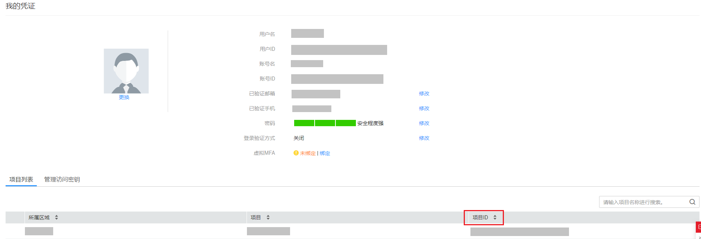

# 获取项目编码

在调用接口的时候，部分URI中需要填入项目编号，所以需要先在管理控制台上获取到项目编号。

项目编号获取步骤如下：

1.  注册并登录管理控制台。
2.  单击用户名，在下拉列表中单击“我的凭证”。

    在“我的凭证”页面的项目列表中，根据所属区域、项目，选择具体的项目ID，例如Project ID:"5a3314075bfa49b9ae360f4ecd333695"。

    **图 1**  获取项目编码  
    

