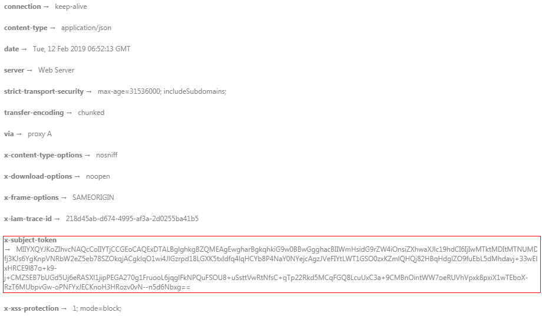

# 返回结果<a name="ges_03_0138"></a>

-   [状态码](#section137155091919)
-   [响应消息头](#section773113011910)
-   [响应消息体](#section1960421114814)

## 状态码<a name="section137155091919"></a>

请求发送以后，您会收到响应，包含状态码、响应消息头和消息体。

状态码是一组从1xx到5xx的数字代码，状态码表示了请求响应的状态，完整的状态码列表请参见[状态码](状态码.md)。

对于IAM[获取用户Token](https://support.huaweicloud.com/api-iam/iam_30_0001.html)接口，如果调用后返回状态码为“201”，则表示请求成功。

## 响应消息头<a name="section773113011910"></a>

对应请求消息头，响应同样也有消息头，如“Content-Type”。例如[表1](#d0e872)所示。

**表 1**  响应消息头

<a name="d0e872"></a>
<table><thead align="left"><tr id="row30056148"><th class="cellrowborder" valign="top" width="30%" id="mcps1.2.3.1.1"><p id="p18628895"><a name="p18628895"></a><a name="p18628895"></a>参数名</p>
</th>
<th class="cellrowborder" valign="top" width="70%" id="mcps1.2.3.1.2"><p id="p32545531"><a name="p32545531"></a><a name="p32545531"></a>说明</p>
</th>
</tr>
</thead>
<tbody><tr id="row18942351"><td class="cellrowborder" valign="top" width="30%" headers="mcps1.2.3.1.1 "><p id="p57935492"><a name="p57935492"></a><a name="p57935492"></a>Content-Length</p>
</td>
<td class="cellrowborder" valign="top" width="70%" headers="mcps1.2.3.1.2 "><p id="p62263298"><a name="p62263298"></a><a name="p62263298"></a>响应消息体的字节长度，单位为Byte。</p>
</td>
</tr>
<tr id="row23498771"><td class="cellrowborder" valign="top" width="30%" headers="mcps1.2.3.1.1 "><p id="p24352304"><a name="p24352304"></a><a name="p24352304"></a>Date</p>
</td>
<td class="cellrowborder" valign="top" width="70%" headers="mcps1.2.3.1.2 "><p id="p26379626"><a name="p26379626"></a><a name="p26379626"></a>系统响应的时间。</p>
</td>
</tr>
<tr id="row36090045"><td class="cellrowborder" valign="top" width="30%" headers="mcps1.2.3.1.1 "><p id="p37612524"><a name="p37612524"></a><a name="p37612524"></a>Content-type</p>
</td>
<td class="cellrowborder" valign="top" width="70%" headers="mcps1.2.3.1.2 "><p id="p26715628"><a name="p26715628"></a><a name="p26715628"></a>发送的实体的MIME类型。</p>
</td>
</tr>
<tr id="row1848110155406"><td class="cellrowborder" valign="top" width="30%" headers="mcps1.2.3.1.1 "><p id="p114821015154011"><a name="p114821015154011"></a><a name="p114821015154011"></a>TraceID</p>
</td>
<td class="cellrowborder" valign="top" width="70%" headers="mcps1.2.3.1.2 "><p id="p10482151517407"><a name="p10482151517407"></a><a name="p10482151517407"></a>请求返回的ID，便于问题定位。</p>
</td>
</tr>
</tbody>
</table>

对于IAM[获取用户Token](https://support.huaweicloud.com/api-iam/iam_30_0001.html)接口，返回如[图1](#fig20354135015228)所示的消息头，其中“x-subject-token”就是需要获取的用户Token。有了Token之后，您就可以使用Token认证调用其他API。

**图 1**  获取用户Token响应消息头<a name="fig20354135015228"></a>  


## 响应消息体<a name="section1960421114814"></a>

响应消息体通常以结构化格式返回，与响应消息头中Content-type对应，传递除响应消息头之外的内容。

对于IAM[获取用户Token](https://support.huaweicloud.com/api-iam/iam_30_0001.html)接口，返回如下消息体。为篇幅起见，这里只展示部分内容。

```
{
    "token": {
        "expires_at": "2019-02-13T06:52:13.855000Z",
        "methods": [
            "password"
        ],
        "catalog": [
            {
                "endpoints": [
                    {
                        "region_id": "cn-north-1",
                        ......
```

当接口调用出错时，会返回错误码及错误信息说明，错误响应的Body体格式如下所示。

```
{
    "error_msg": "The format of message is error",
    "error_code": "AS.0001"
}
```

其中，error\_code表示错误码，error\_msg表示错误描述信息。

