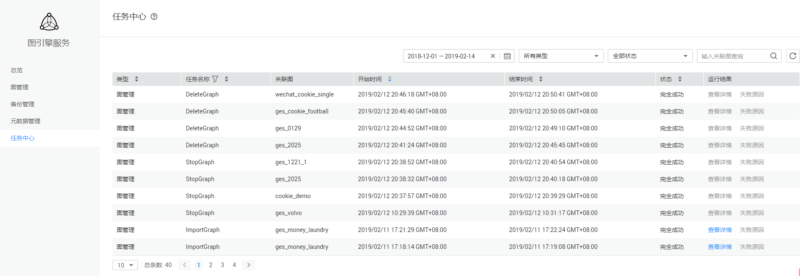
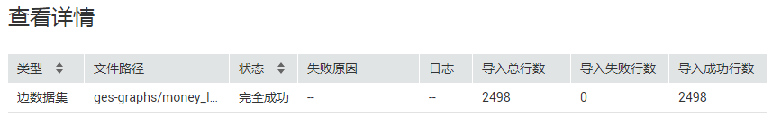
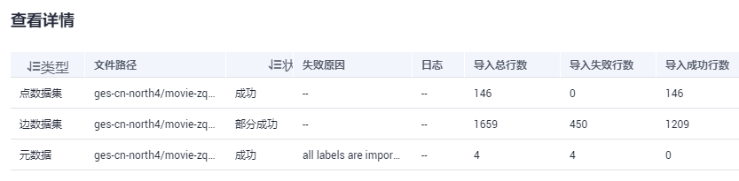

# 任务中心

任务中心可用于查看创建图、备份图、启动图、删除图等异步任务的详情。

可以在页面查看对应图所执行任务的类型，任务名称，关联图，开始时间，结束时间，状态和运行结果。

**图 1**  任务中心  

-   在“运行结果“列中可“查看详情“，查看“失败原因“和任务ID。

    **图 2**  查看详情  
    

    导入图时，如果任务状态为“部分成功”，可以单击“查看详情”，查看失败的数据“类型“  ，“导入失败行数“等信息，失败的具体原因，请查看导入图时指定的日志路径（可选），失败的日志会上传到该路径下。

    **图 3**  部分成功  
    

-   可以通过以下五种方式查找任务
    -   通过设置时间查找
    -   通过选择类型查找
    -   通过选择状态查找
    -   通过输入关联图进行查找
    -   通过在任务列表中筛选任务名称进行查找

