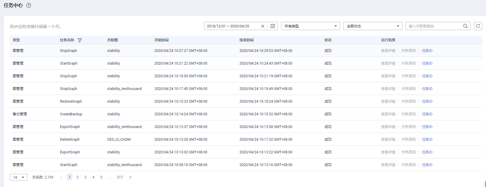

# 任务中心

## 操作场景

业务面任务中心功能，可以查看图当前正在运行和历史上运行过的异步任务。

## 操作步骤

1.  登录管理控制台。
2.  在左侧导航栏中选择“图管理“，单击图管理操作列中的“更多 \> 任务中心“，进入“任务中心“页面。

    **图 1**  任务中心  
    

    > **说明：** 
    >-   2.2.23及以上版本的图可以使用该功能。
    >-   当图的运行状态显示为运行中、导入中、导出中和清空中的状态时可以点击进入任务中心页面，否则是置灰状态。

3.  在“任务中心“页面左上角下拉框中选择对应副本后，查看当前图正在运行和历史上运行过的异步任务的详细信息，包括以下字段：
    -   jobID：异步任务的jobId。
    -   任务类型：异步任务类型（类型包括ImportGraph、VertexQuery）。
    -   原始请求：用户发给接口原始请求的body体。
    -   状态：包括等待、运行中、完成、取消四种。
    -   进度：表示当前任务的运行进度。
    -   开始时间：任务开始运行的时间，如果任务没有开始运行，该值为空。
    -   结束时间：任务结束运行的时间，如果任务没有结束运行，该值为空。
    -   操作：可以操作是否停止任务。

4.  如果想要查看某个具体的异步任务详情，可以在页面右上角的搜索框中输入jobId进行查询。

