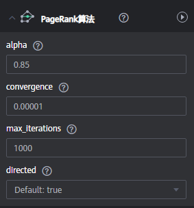
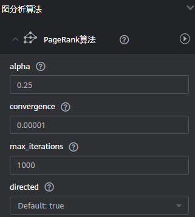

# 使用算法分析图

## 操作场景

社交网络、电商推荐等场景下，常常可以使用图算法做关系分析、社团发现。举例来说，使用PageRank算法分析社交网络中的关键人物；使用最短路径算法找到人物之间的关系路径、做好友推荐；使用k-core算法做小圈子发现等。

## 操作步骤

1.  进入图引擎编辑器页面，详细操作请参见[访问图引擎编辑器](访问图引擎编辑器.md)。
2.  在算法分析区，你可以选择算法，并设置参数。

    图引擎服务支持的算法如[算法一览表](算法一览表.md)所示，详细算法介绍请参见[算法参考](算法参考.md)。

    **图 1**  设置算法参数  
    

3.  单击运行算法分析，您可以在如下界面获取查询结果。

    **图 2**  查询分析结果  
    

4.  以模板中的电影数据为例，调整参数后得到的PagRank值不同，但TOP排序不会有明显差异。

    挑出了最有影响力的两部电影，分别是ID Lethal Weapon 和ID Jaws。

    **图 3**  调整参数  
    

    **图 4**  调整参数后的查询结果  
    

5.  分析一下他们的关联程度，关联度达到0.35，说明还是有不少人同时看过这两部电影的。

    **图 5**  关联分析  
    

    **图 6**  关联分析结果  
    

