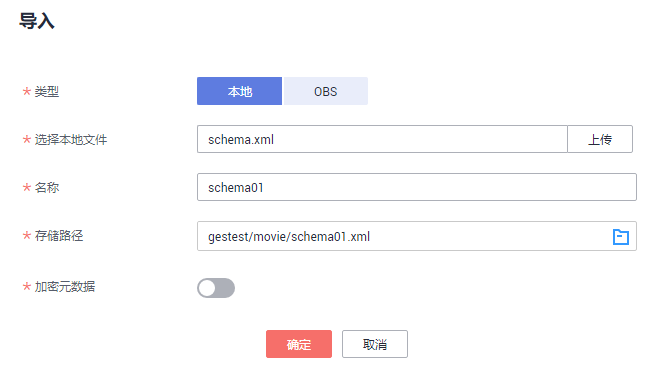
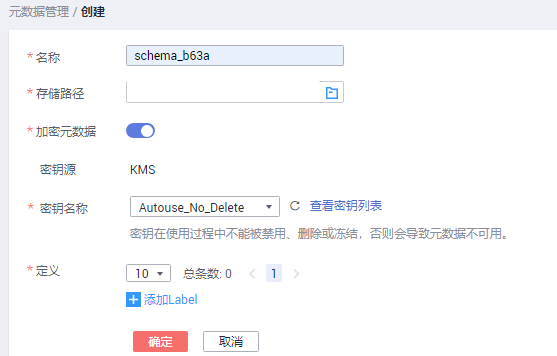

# 元数据管理

元数据指图数据中的元数据。在图引擎服务的管理控制台，您可以从本地或从OBS导入元数据、创建元数据、编辑元数据或删除元数据。

## 导入元数据

如果已有元数据文件，您可以选择将元数据文件导入到图引擎服务中，以便后续创建图使用。

1.  在图引擎管理控制台，单击左侧导航栏的“元数据管理“。
2.  在“元数据管理“页面，单击“导入“。
3.  在“导入“页面，您可以从本地或从OBS中导入元数据。
    1.  从本地导入

        “选择本地文件“：单击“上传“，选择本地的文件。

        > **说明：**   
        >文件格式必须为xml格式。  

        “名称“：您可以在文件名称文本框中定义元数据文件的名字。

        “存储路径“：选择元数据文件存储的OBS路径。

        **图 1**  从本地导入元数据  
        

    2.  从OBS导入

        “选择文件路径“：单击从OBS中选择元数据文件。

        > **说明：**   
        >-   文件格式必须为xml。  
        >-   您需要提前将元数据文件上传至OBS中。  

        “名称“：元数据在图引擎服务中的文件名称。

        **图 2**  从OBS导入元数据  
        

4.  单击“确定“完成操作。

    导入完成后，元数据文件将展示在元数据管理页面中。

## 创建元数据

如果本地或OBS中都没有元数据文件，您可以手动创建元数据文件。

1.  在“元数据管理“页面，单击右上角“创建“。
2.  名称：输入元数据的名称，文件格式默认为xml。
3.  存储路径：选择OBS存储路径，请选择一个文件夹来存储数据。
4.  定义：元数据文件中详细的Label定义。一个元数据文件可定义多个Label，您可单击“添加Lable“按需增加。

    在Label定义中，您需要定义Label名称，并在对应Label下添加Property，单击Lable名称下的“添加“，增加属性，还可通过“上移“、“下移“操作对Property进行排序。Property设置参数信息如[表1](#table5321853516046)所示，其他元数据详情请参考[图数据的格式](图数据的格式.md)。

    **图 3**  创建元数据  
    

    **表 1**  Property参数

    
    <table><thead align="left"><tr id="row3677340316046"><th class="cellrowborder" valign="top" width="34.4%" id="mcps1.2.3.1.1">
参数名称

    </th>
    <th class="cellrowborder" valign="top" width="65.60000000000001%" id="mcps1.2.3.1.2">
描述

    </th>
    </tr>
    </thead>
    <tbody><tr id="row1157016616046"><td class="cellrowborder" valign="top" width="34.4%" headers="mcps1.2.3.1.1 ">
Property名称

    </td>
    <td class="cellrowborder" valign="top" width="65.60000000000001%" headers="mcps1.2.3.1.2 ">
属性的名称，长度限制为1到64位，且不能包含&lt; &gt; &amp;。

    </td>
    </tr>
    <tr id="row2489762316046"><td class="cellrowborder" valign="top" width="34.4%" headers="mcps1.2.3.1.1 ">
基数

    </td>
    <td class="cellrowborder" valign="top" width="65.60000000000001%" headers="mcps1.2.3.1.2 ">
数据的复合类型。

    <ul id="ul5670247162123"><li>单值</li><li>多值：勾选是否允许重复值。</li></ul>
    </td>
    </tr>
    <tr id="row1526586516046"><td class="cellrowborder" valign="top" width="34.4%" headers="mcps1.2.3.1.1 ">
数据类型

    </td>
    <td class="cellrowborder" valign="top" width="65.60000000000001%" headers="mcps1.2.3.1.2 ">
属性的数据类型。当前支持char、float、double、bool、long、int、date、enum、string。

    </td>
    </tr>
    <tr id="row5399594216434"><td class="cellrowborder" valign="top" width="34.4%" headers="mcps1.2.3.1.1 ">
操作

    </td>
    <td class="cellrowborder" valign="top" width="65.60000000000001%" headers="mcps1.2.3.1.2 ">
删除：删除不需要的属性。

    </td>
    </tr>
    </tbody>
    </table>

5.  单击“确定“完成操作，当文件创建完成后，元数据文件将展示在元数据管理页面。

## 查找元数据

在元数据管理页面，您可以在搜索框中输入元数据文件的名称进行查找。

## 复制元数据

编辑元数据时，会覆盖之前的元数据文件，为避免原始元数据文件丢失，建议您在编辑元数据之前，先复制一份元数据。

1.  在“元数据管理“页面，在对应的元数据文件的“操作“列，单击“复制“。
2.  定义元数据文件名称以及存储路径，然后单击“确定“。

    “名称“：复制后的元数据文件名称，仅需要设置名称，文件格式默认为xml。

    “存储路径“：存储元数据文件的OBS路径。

    文件复制成功后，新的元数据文件将在元数据管理页面呈现。

    **图 4**  复制元数据文件  
    

## 编辑元数据

如果导入或创建的元数据文件不符合业务诉求，需要进行变更，您可以通过编辑元数据对Label和Property进行修改。

编辑元数据文件完成后，将覆盖之前的元数据文件。为避免数据丢失，建议您在编辑前，先复制一份元数据。

1.  在“元数据管理“页面，在对应的元数据文件的“操作“列，单击“编辑“。
2.  在“编辑“页面，您可以添加Label、添加Property、修改Label名称、通过上移和下移调整Property排序等操作。
3.  修改完成后，单击“确定“保存修改。

## 删除元数据

当元数据文件失效后，您可以在“元数据管理“页面，在对应的元数据文件操作列中单击“删除“，删除元数据文件。

> **说明：**   
>数据删除后无法恢复，请谨慎操作。  

