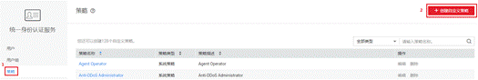
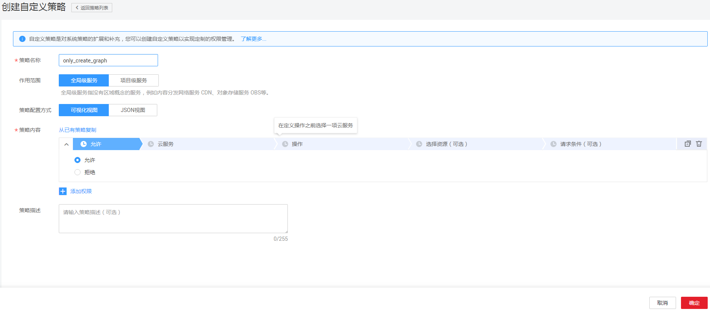
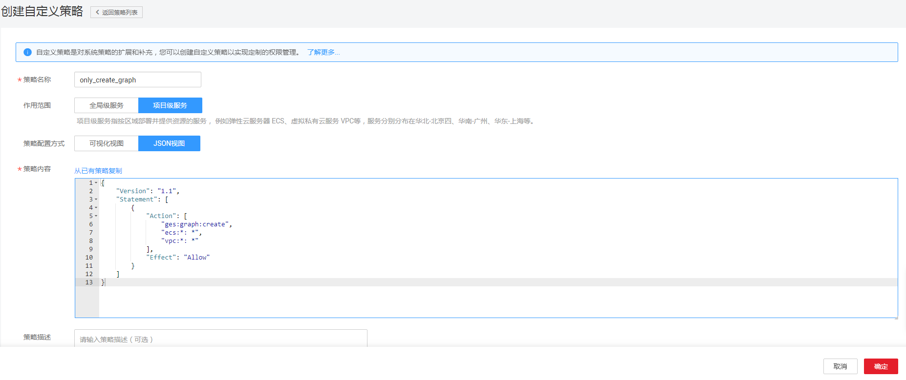
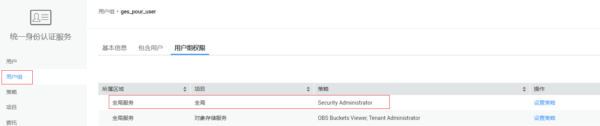

# 创建GES自定义策略<a name="ges_01_0075"></a>

如果系统预置的GES权限，不满足您的授权要求，可以创建自定义策略。自定义策略中可以添加的授权项（Action）请参考[权限策略和授权项](https://support.huaweicloud.com/api-ges/ges_03_0148.html)。

目前华为云支持以下两种方式创建自定义策略：

-   可视化视图创建自定义策略：无需了解策略语法，按可视化视图导航栏选择云服务、操作、资源、条件等策略内容，可自动生成策略。
-   JSON视图创建自定义策略：可以在选择策略模板后，根据具体需求编辑策略内容；也可以直接在编辑框内编写JSON格式的策略内容。

以下以定制一个用户创建“only\_create\_graph”的策略为例，创建一个仅支持创建图的自定义策略。

分别采用可视化视图和JSON视图的配置方式创建自定义策略。

## 前提条件<a name="section1783020250912"></a>

-   请先在IAM控制台中开通细粒度策略，开通方法请参见：[申请细粒度访问控制公测](https://support.huaweicloud.com/usermanual-iam/iam_01_019.html)。
-   如需使用JSON视图创建自定义策略，请您先熟悉策略结构，具体请参见[策略语法：细粒度策略](策略语法-细粒度策略.md)。
-   请确定自定义策略需要允许哪些操作，拒绝哪些操作，并获取操作对应的授权项。授权项请参见[权限策略和授权项](https://support.huaweicloud.com/api-ges/ges_03_0148.html)。

## 可视化视图配置自定义策略<a name="section1685812251199"></a>

1.  在IAM控制台，单击左侧导航栏的“策略”，在右上角选择“创建自定义策略”。

    **图 1**  创建自定义策略<a name="fig6544184319582"></a>  
    

2.  在“创建自定义策略”中，配置如下信息：

    **图 2**  可视化视图<a name="fig8827151112591"></a>  
    

    -   策略名称：填写“only\_create\_graph”。
    -   作用范围：根据服务的属性填写，GES为项目级服务，选择“项目级服务”。
    -   策略配置方式：选择“可视化视图”。
    -   策略内容：
        1.  选择“允许”。
        2.  在“云服务”中选择“图引擎服务”。
        3.  在“操作”中勾选“ReadWrite”中的“ges:graph:create”,即“创建图”。

3.  单击“确定”，自定义策略创建成功。

## JSON视图配置自定义策略<a name="section1021716587153"></a>

1.  在IAM控制台，单击左侧导航栏的“策略”，在右上角选择“创建自定义策略”。请参考[图1](#fig6544184319582)。
2.  在“创建自定义策略”中，填写如下参数。

    **图 3**  JSON视图<a name="fig1721735861511"></a>  
    

    -   策略名称：填写“only\_create\_graph”。
    -   作用范围：根据服务的属性填写，GES为项目级服务，选择“项目级服务”。
    -   策略配置方式：选择“Json视图”。
    -   策略内容：

        -   将如下内容拷贝至策略内容中。如下策略表示允许创建图。

            ```
            {
                    "Version": "1.1",
                    "Statement": [
                            {
                                    "Action": [
                                            "ges:graph:create",
                                            "ecs:*: *",
                                            "vpc:*: *",
                                    ],
                                    "Effect": "Allow"
                            }
                    ]
            }
            ```

        -   从已有策略复制：可选择已有策略复制后，再根据需要修改。

        系统会自动校验语法，若有错误，对应行号将会标红。

3.  单击“确定”，如跳转到策略列表，则自定义策略创建成功；如提示“策略内容错误”，请按照语法规范进行修改。

## 验证定义策略权限<a name="section3524111645113"></a>

1.  将新创建的自定义策略授予用户组，使得用户组中的用户仅具备创建图的权限。

    如果需要创建带EIP的图，则还需要在用户组的全局策略中配上Security Administrator权限。如[图4](#fig54538229715)所示，可在对应用户组权限中查看是否配置Security Administrator权限。

    **图 4**  配置全局权限<a name="fig54538229715"></a>  
    

2.  用户登录并验证自定义策略定义的权限：only\_create\_graph。

    权限授予成功后，用户可以通过控制台以及REST API等多种方式验证。此处以登录控制台为例，介绍用户如何验证编辑作业的权限。

    1.  使用新创建的用户登录华为云，登录方法选择为“IAM用户登录”。
        -   账号名为该IAM用户所属华为云账号的名称。
        -   用户名和密码为账号在IAM创建用户时输入的用户名和密码。

    2.  在GES管理控制台，进行创建图操作，操作成功，权限配置正确并已生效。
    3.  尝试进行其他操作，例如：导入图。

        系统显示“权限不足”，权限配置正确并已生效。

        > **说明：**   
        >由于缓存的存在，对用户和用户组授予OBS相关的RBAC策略后，大概需要等待13分钟RBAC策略才能生效；授予细粒度策略后，大概需要等待5分钟细粒度策略才能生效。  


## 策略样例<a name="section1493518251395"></a>

-   示例1：授权用户拥有查询类权限、操作图权限

    ```
    { 
        "Version": "1.1", 
        "Statement": [ 
            { 
                "Effect": "Allow", 
                "Action": [ 
                         "ges:*:get*",
                         "ges:*:list*",
                         "ges:graph:operate"
                ] 
            } 
        ] 
    }
    ```

-   示例2：拒绝用户删除图

    拒绝策略需要同时配合其他策略使用，否则没有实际作用。用户被授予的策略中，一个授权项的作用如果同时存在Allow和Deny，则遵循Deny优先。

    如果您给用户授予GES Admin的系统策略，但不希望用户拥有GES Admin中定义的删除图权限，您可以创建一条拒绝删除独享集群的自定义策略，然后同时将GES Admin和拒绝策略授予用户，根据Deny优先原则，则用户可以对GES执行除了删除图外的所有操作。拒绝策略示例如下：

    ```
    { 
          "Version": "1.1", 
          "Statement": [ 
                { 
    		  "Effect": "Deny", 
                      "Action": [ 
                            "ges:graph:delete" 
                      ] 
                } 
          ] 
    }
    ```

-   示例3：授权用户操作图名称前缀为ges\_project的图（ges\_project名字不区分大小写），访问图列表。

    ```
    {
        "Version": "1.1",
        "Statement": [
            {
                "Effect": "Allow",
                "Action": [
                    "ges:graph:create",
                    "ges:graph:delete",
                    "ges:graph:access",
                    "ges:graph:getDetail"
                ],
                "Resource": [
                    "ges:*:*:graphName:ges_project*"
                ]
            },
            {
                "Effect": "Allow",
                "Action": [
                    "ges:graph:list"
                ]
            }
        ]
    }
    ```

-   示例4：授权用户操作部分图资源，查看所有资源。

    该策略分为两部分：

    -   第一部分：授权用户操作资源名称前缀为ges\_project的资源，资源包含图、元数据、备份。
    -   第二部分：授权用户查询图列表、查询备份列表、查询任务列表、查询元数据列表、校验元数据文件、查看job详情。

    ```
    {
        "Version": "1.1",
        "Statement": [
            {
                "Action": [
                    "ges:backup:delete",
                    "ges:graph:access",
                    "ges:metadata:create",
                    "ges:graph:operate",
                    "ges:graph:delete",
                    "ges:metadata:delete",
                    "ges:graph:create",
                    "ges:backup:create",
                    "ges:metadata:getDetail",
                    "ges:graph:getDetail"
                ],
                "Resource": [
                    "ges:*:*:backupName:ges_project*",
                    "ges:*:*:graphName:ges_project*",
                    "ges:*:*:metadataName:ges_project*"
                ],
                "Effect": "Allow"
            },
            {
                "Action": [
                    "ges:graph:list",
                    "ges:backup:list",
                    "ges:jobs:list",
                    "ges:metadata:list",
                    "ges:metadata:operate",
                    "ges:jobs:getDetail"
                ],
                "Effect": "Allow"
            }
        ]
    }
    ```


