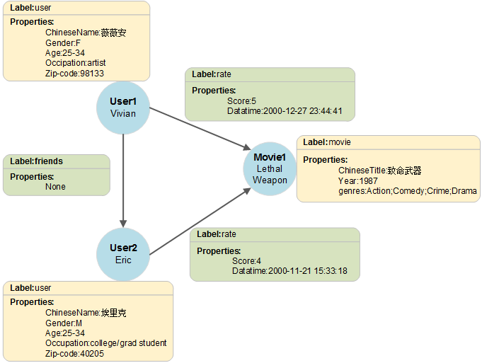
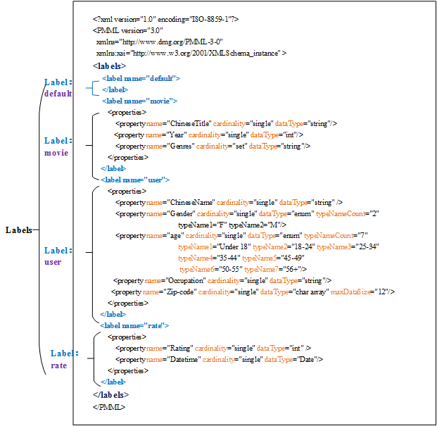

# 图数据的格式<a name="ges_01_0044"></a>

在导入图数据之前，您需要了解GES中支持的图数据格式。

-   GES支持载入具有标准csv格式的原始图数据，如果您的原始数据并不符合指定的格式，则需要将数据整理为GES支持的格式。
-   GES支持的图数据格式包含三部分：点文件、边文件以及元数据。
    -   点文件用于存放点数据。
    -   边文件用于存放边数据。
    -   元数据用于描述点文件和边文件中的数据格式。


## 概念说明<a name="section276565145218"></a>

GES基于属性图模型导入图数据，因此，您需要了解属性图（Property graph）的基本概念。

一个属性图是由点、边、标签（Label）和属性（Property）组成的有向图。

-   点又称作节点（Node），边又称作关系（Relationship），点和关系是最重要的实体。
-   元数据是用于描述点或边的属性信息，元数据由多个标签组成，每个标签由一个或多个属性组成。
-   为点或边设置标签，那么拥有相同标签的点属于一个分组，是一个集合。
-   点和边只能设置一个标签。

如下示例中，此图数据由3个点和3条边组成，Vivian、Eric和Lethal Weapon表示点，（Vivian，Eric）、（Vivian，Lethal Weapon）和（Eric、Lethal Weapon）表示边，user和movie表示点的类型（标签），rate和friends表示关系类型（标签）。

**图 1**  图数据格式的示例<a name="fig48931053411"></a>  


## 元数据<a name="section83311432141818"></a>

GES的元数据用于定义点和边的属性信息，为XML格式的文件。

在元数据中包含了标签（Label）和属性（Property）。

-   **标签（Label）**

    标签是属性的集合，描述了一个点或边拥有的所有属性的数据格式。

    > **说明：**   
    >在不同的标签中，如果定义了相同的属性名称（Property name），则定义的cardinality和dataType需要跟已定义的一致。  

-   **属性（Property）**

    属性指的是单个属性的数据格式，包含3个字段。

    -   Property name：属性名称。

        > **说明：**   
        >同一个标签中不能包含相同的Property name。  

    -   cardinality：数据的复合类型，取值为single、list和set。
        -   single是单值类型，表示该属性的数据是一个单值，如一个数字或一个字符串。
        -   list和set是集合类型，表示该属性的数据由多个值组成，不同的值用分号分隔。

            > **说明：**   
            >list和set类型不支持char array数据类型。  


    -   dataType：数据类型，支持的的数据类型如下表所示。

        **表 1**  支持的数据类型

        <a name="table8260185120115"></a>
        <table><thead align="left"><tr id="row193611512117"><th class="cellrowborder" valign="top" width="26%" id="mcps1.2.3.1.1"><p id="p1336115511613"><a name="p1336115511613"></a><a name="p1336115511613"></a>类型</p>
        </th>
        <th class="cellrowborder" valign="top" width="74%" id="mcps1.2.3.1.2"><p id="p53621851914"><a name="p53621851914"></a><a name="p53621851914"></a>描述</p>
        </th>
        </tr>
        </thead>
        <tbody><tr id="row18362351217"><td class="cellrowborder" valign="top" width="26%" headers="mcps1.2.3.1.1 "><p id="p12362155119112"><a name="p12362155119112"></a><a name="p12362155119112"></a>string</p>
        </td>
        <td class="cellrowborder" valign="top" width="74%" headers="mcps1.2.3.1.2 "><p id="p13362155111113"><a name="p13362155111113"></a><a name="p13362155111113"></a>不定长字符串类型。</p>
        </td>
        </tr>
        <tr id="row1436215511215"><td class="cellrowborder" valign="top" width="26%" headers="mcps1.2.3.1.1 "><p id="p83625519118"><a name="p83625519118"></a><a name="p83625519118"></a>char</p>
        </td>
        <td class="cellrowborder" valign="top" width="74%" headers="mcps1.2.3.1.2 "><p id="p20362175115113"><a name="p20362175115113"></a><a name="p20362175115113"></a>字符。</p>
        </td>
        </tr>
        <tr id="row0362175118118"><td class="cellrowborder" valign="top" width="26%" headers="mcps1.2.3.1.1 "><p id="p436213519111"><a name="p436213519111"></a><a name="p436213519111"></a>char array</p>
        </td>
        <td class="cellrowborder" valign="top" width="74%" headers="mcps1.2.3.1.2 "><p id="p1146640172613"><a name="p1146640172613"></a><a name="p1146640172613"></a>定长字符串（需指定长度）。</p>
        <div class="note" id="note15340204819263"><a name="note15340204819263"></a><a name="note15340204819263"></a><span class="notetitle"> 说明： </span><div class="notebody"><p id="p1134015488265"><a name="p1134015488265"></a><a name="p1134015488265"></a>只有single类型支持该数据类型。</p>
        </div></div>
        </td>
        </tr>
        <tr id="row1436213514119"><td class="cellrowborder" valign="top" width="26%" headers="mcps1.2.3.1.1 "><p id="p1362165116118"><a name="p1362165116118"></a><a name="p1362165116118"></a>float</p>
        </td>
        <td class="cellrowborder" valign="top" width="74%" headers="mcps1.2.3.1.2 "><p id="p16362125112112"><a name="p16362125112112"></a><a name="p16362125112112"></a>float浮点类型（32位浮点）。</p>
        </td>
        </tr>
        <tr id="row136285112118"><td class="cellrowborder" valign="top" width="26%" headers="mcps1.2.3.1.1 "><p id="p17362175113118"><a name="p17362175113118"></a><a name="p17362175113118"></a>double</p>
        </td>
        <td class="cellrowborder" valign="top" width="74%" headers="mcps1.2.3.1.2 "><p id="p11362145116110"><a name="p11362145116110"></a><a name="p11362145116110"></a>double浮点类型（64位浮点）。</p>
        </td>
        </tr>
        <tr id="row53621451518"><td class="cellrowborder" valign="top" width="26%" headers="mcps1.2.3.1.1 "><p id="p4362155114112"><a name="p4362155114112"></a><a name="p4362155114112"></a>bool</p>
        </td>
        <td class="cellrowborder" valign="top" width="74%" headers="mcps1.2.3.1.2 "><p id="p2036225110118"><a name="p2036225110118"></a><a name="p2036225110118"></a>bool类型，取值（0/1）或者（true/false）。</p>
        </td>
        </tr>
        <tr id="row0362115115116"><td class="cellrowborder" valign="top" width="26%" headers="mcps1.2.3.1.1 "><p id="p123630511315"><a name="p123630511315"></a><a name="p123630511315"></a>long</p>
        </td>
        <td class="cellrowborder" valign="top" width="74%" headers="mcps1.2.3.1.2 "><p id="p1336311514119"><a name="p1336311514119"></a><a name="p1336311514119"></a>长整数类型（取值范围-2^63 to 2^63-1）。</p>
        </td>
        </tr>
        <tr id="row936395115110"><td class="cellrowborder" valign="top" width="26%" headers="mcps1.2.3.1.1 "><p id="p036312516118"><a name="p036312516118"></a><a name="p036312516118"></a>int</p>
        </td>
        <td class="cellrowborder" valign="top" width="74%" headers="mcps1.2.3.1.2 "><p id="p2036312518114"><a name="p2036312518114"></a><a name="p2036312518114"></a>整数类型（取值范围-2^31 to 2^31-1）。</p>
        </td>
        </tr>
        <tr id="row113631051811"><td class="cellrowborder" valign="top" width="26%" headers="mcps1.2.3.1.1 "><p id="p13631351019"><a name="p13631351019"></a><a name="p13631351019"></a>date</p>
        </td>
        <td class="cellrowborder" valign="top" width="74%" headers="mcps1.2.3.1.2 "><p id="p1520320281027"><a name="p1520320281027"></a><a name="p1520320281027"></a>日期，目前支持格式如下所示：</p>
        <p id="p33631751616"><a name="p33631751616"></a><a name="p33631751616"></a>YYYY-MM-DD HH:MM:SS</p>
        <p id="p436312511816"><a name="p436312511816"></a><a name="p436312511816"></a>YYYY/MM/DD HH:MM:SS</p>
        <p id="p53631551715"><a name="p53631551715"></a><a name="p53631551715"></a>DD.MM.YY HH:MM:SS</p>
        <p id="p15363651118"><a name="p15363651118"></a><a name="p15363651118"></a>YYYY-MM-DD</p>
        <p id="p16363151417"><a name="p16363151417"></a><a name="p16363151417"></a>MM/DD</p>
        <p id="p336316511814"><a name="p336316511814"></a><a name="p336316511814"></a>HH:MM</p>
        </td>
        </tr>
        <tr id="row736345113114"><td class="cellrowborder" valign="top" width="26%" headers="mcps1.2.3.1.1 "><p id="p123631551518"><a name="p123631551518"></a><a name="p123631551518"></a>enum</p>
        </td>
        <td class="cellrowborder" valign="top" width="74%" headers="mcps1.2.3.1.2 "><p id="p33634512120"><a name="p33634512120"></a><a name="p33634512120"></a>枚举类型（需指定枚举类型的个数以及每个枚举值）。</p>
        </td>
        </tr>
        </tbody>
        </table>


元数据的示例如下所示：

**图 2**  元数据示例<a name="fig4231160141019"></a>  


## 点文件<a name="section129243382011"></a>

点文件罗列了各个点的数据信息。一行为一个点的数据。格式如下所示，id是点数据的唯一标识。

```
id, label, property 1, property 2, property 3,…
```

示例：

```
Lethal Weapon,movie,致命武器,1987,Action;Comedy;Crime;Drama
Vivian,user,薇薇安,F,25-34,artist,98133
Eric,user,埃里克,M,18-24,college/grad student,40205
```

## 边文件<a name="section125131836142018"></a>

边文件罗列了各个边的数据信息，一行为一条边的数据。GES中图规格是以边的数量进行定义的，如一百万边。格式如下所示，id 1、id 2是一条边的两个端点的id。

```
id 1, id 2, label, property 1, property 2, …
```

示例：

```
Vivian,Lethal Weapon,rate,5,2000-12-27 23:44:41
Eric,Lethal Weapon,rate,4,2000-11-21 15:33:18
Vivian,Eric,friends
```

