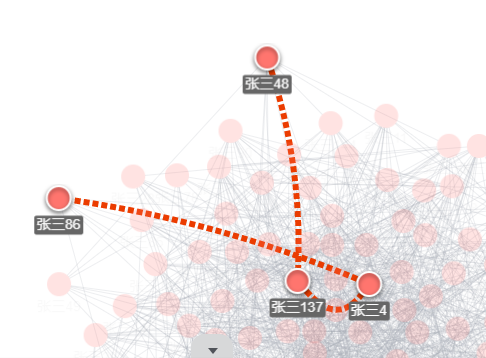
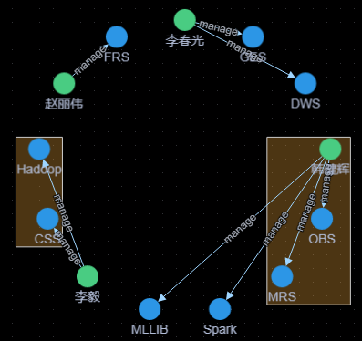
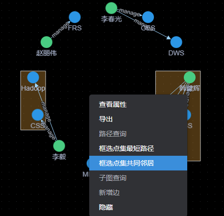
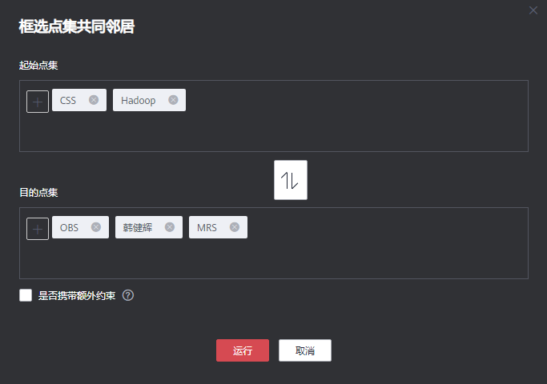
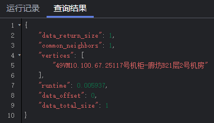

# 在绘图区分析图

## 操作场景

绘图区直观地展示了图数据的情况，您也可以通过绘图区对数据进行编辑和分析。

绘图区的快捷键以及界面元素的功能，请参见[表3](编辑器页面介绍.md#table13009775611)。

## 操作步骤

1.  进入图引擎编辑器页面，详细操作请参见[访问图引擎编辑器](访问图引擎编辑器.md)。
2.  在绘图区，使用鼠标右键单击一个点或一条边，执行以下操作。

    **图 1**  右键选项  
    

    -   **查看属性**

        选中查看属性，可以在属性页签查看选中的点或边的属性信息。

        **图 2**  查看属性  
        

    -   **一跳查询**

        扩展出与当前点有关联的点，可以选择OUT（沿出边\)、IN（沿入边）或者ALL（双向）。

        -   OUT：沿出边，查询所有以该点为源点，指向的其他点。
        -   IN：沿入边，查询以该点为终点，指向该点的其他点。
        -   ALL：双向，包含了OUT和IN查询的所有点。

    -   **导出**

        导出当前绘图区显示的图或者数据。

    -   **路径查询**

        查询两节点之间的路径详情，将列举出所有可能的路径。

        具体操作：选择两个点。先按下Ctrl，再分别单击两个点，其中第一个点为source，第二个点为target，然后单击右键，选中“路径查询”。

        > **说明：** 
        >只有当选中两个点时该选项才可用，否则置灰。

        运行结束后将清空绘图区，返回点边数据并渲染绘图区，将根据选中的两个点描绘一条路径。

        **图 3**  路径查询  
        

    -   **框选点集最短路径**
        1.  按下Shift+鼠标左键框选一组点（可以是单个点，也可以是多个点）。
        2.  按下Shift+鼠标左键框选另外一组点（可以是单个点，也可以是多个点）。
        3.  在框选范围内单击鼠标右键，在弹出的菜单中选择“框选点集最短路径”。
        4.  在框选点集最短路径弹框中，可以对所选的两组点集进行编辑，单击“+”可以快速加入点。
        5.  单击“运行”，将返回两个点集之间的最短路径。

    -   **框选点集共同邻居**（Common Neighbors of Vertex Sets）
        -   功能介绍

            框选点集共同邻居可以得到两个点集合（群体集合）所共有的邻居（即两个群体临域的交集），直观的发现与两个群体共同联系的对象。

        -   操作步骤
            1.  按住shift键拖动框选两个点集。

                **图 4**  框选点集  
                

            2.  在点集上右键，选择“框选点集共同邻居”。

                **图 5**  框选点集共同邻居  
                

            3.  在弹出的窗口确认点集中的点，若有需要可以对点进行增加或删除，以及选择是否需要携带额外参数，然后单击运行。

                **图 6**  确认点集中的点  
                

                > **说明：** 
                >是否携带额外约束：
                >-   不勾选该选项表示找到的共同邻居为起点集和终点集对应邻域的交集。
                >-   勾选该选项表示带额外约束，即找到的共同邻居不仅是起点集和终点集邻域的交集，同时共同邻居集合中的每个点都至少有2个以上邻居节点在起点集和终点集中。

            4.  展示结果。

                **图 7**  图展示  
                

                **图 8**  查询结果  
                

    -   “子图查询“：按住Ctrl，框选一部分点，这些点和这些点之间的边可以构成一个新图例。
    -   “新增边“：添加边功能，有两种方可以选择：
        1.  按住Ctrl单击画布中任意2个点，“右键-\>新增边“可在2点间新增一条边。默认先选中的点为源点，后选中的点为终点。添加后可选择边的label，设置边属性。
        2.  选中某个点，键盘点击“Alt+a“，界面跟随鼠标出现边，拉动边至终点，单击完成边新增。

    -   “隐藏“：可以隐藏选中的点。

