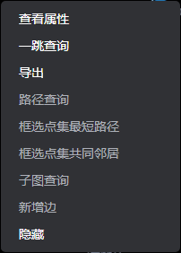
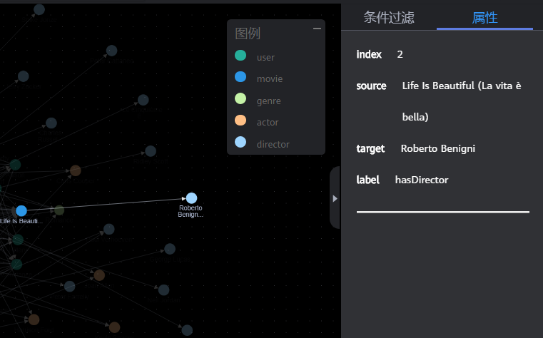
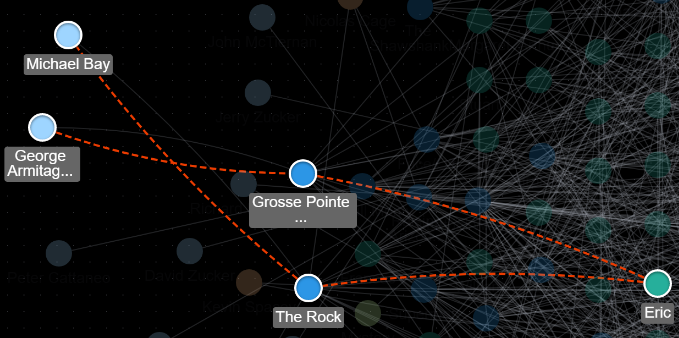

# 在绘图区分析图

## 操作场景

绘图区直观地展示了图数据的情况，您也可以通过绘图区对数据进行分析。

绘图区的快捷键以及界面元素的功能，请参见[表3](编辑器页面介绍.md#table13009775611)。

## 操作步骤

1.  进入图引擎编辑器页面，详细操作请参见[访问图引擎编辑器](访问图引擎编辑器.md)。
2.  在绘图区，使用鼠标右键单击一个点或一条边，可以执行以下操作。

    **图 1**  右键选项  
    

    -   **查看属性**

        选中查看属性，可以在属性页签查看选中的点或边的属性信息。

        **图 2**  查看属性  
        

    -   **扩线查询**

        扩展出与当前点有关联的点，可以选择OUT（沿出边\)、IN（沿入边）或者ALL（双向）。

    -   **导出图片**

        导出当前绘图区显示的图。

    -   **路径查询**

        选择两个点。先按下Ctrl，再分别单击两个点，其中第一个点为target，第二个点为source，然后单击右键，选中“路径查询”。

        > **说明：**   
        >只有当选中两个点时该选项才可用，否则置灰。  

        运行结束后将清空绘图区，返回点边数据并渲染绘图区，将根据选中的两个点描绘一条路径。

        **图 3**  路径查询  
        

    -   **框选点集最短路径**
        1.  按下Shift+鼠标左键框选一组点（可以是单个点，也可以是多个点）。
        2.  按下Shift+鼠标左键框选另一组点（可以是单个点，也可以是多个点）。
        3.  在框选范围内单击鼠标右键，在弹出的菜单中选择“框选点集最短路径”。
        4.  在框选点集最短路径弹框中，可以对所选的两组点集进行编辑，单击“+”可以快速加入点。
        5.  单击“运行”，将返回两个点集之间的最短路径。

