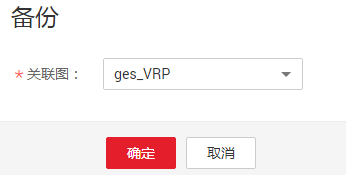
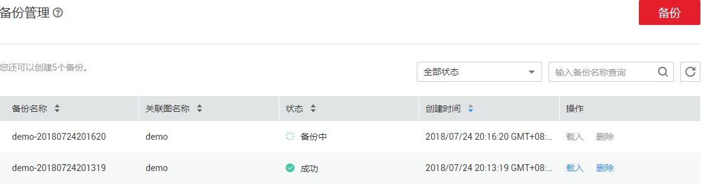

# 备份管理备份图

## 操作场景

为确保数据安全，您可以选择将图数据备份，以便后续出现故障或错误时，可以使用备份数据进行恢复操作。

## 操作步骤

备份操作的入口有两个：“图管理“页面和“备份管理“页面。

-   “图管理“页面操作请参考[图管理备份图](图管理备份图.md)。
-   “备份管理“页面操作如下：
    1.  登录图引擎服务管理控制台。
    2.  在左侧导航栏选择“备份管理“。
    3.  在“备份管理“页面右上角，单击“备份“。
    4.  在备份页面，选择“关联图“，即当前用户创建的图，单击“确定“开始备份。

        **图 1**  备份管理页面备份  
        

        > **说明：**   
        >“备份管理“页面的“备份“操作，可选择“关联图“，但是当系统中只有一个图时，也不能更改其关联图选项。  

    5.  您可以在备份管理列表中查看正在备份或已备份的数据。

        若备份“状态“显示为“备份中“，请耐心等待几分钟，当备份“状态“显示为“成功“时，表示备份成功。

        **图 2**  备份管理  
        

