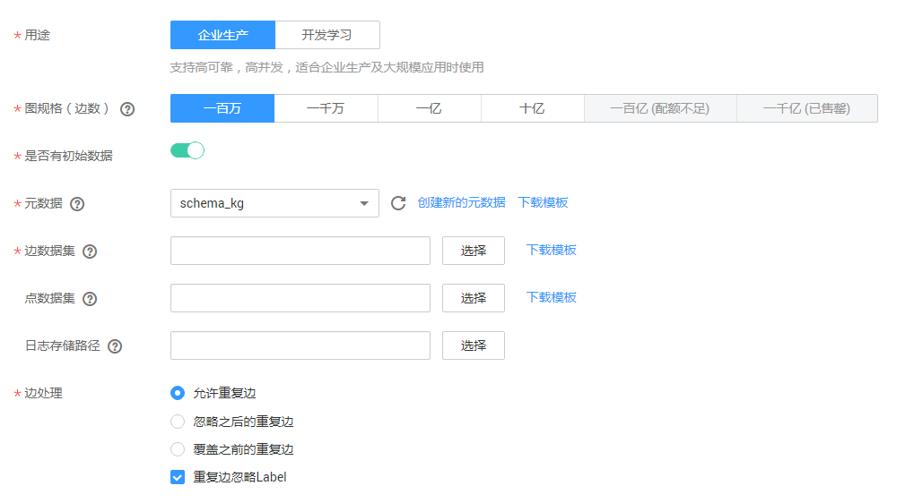
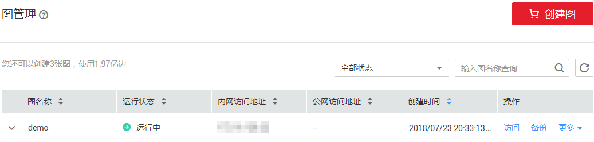
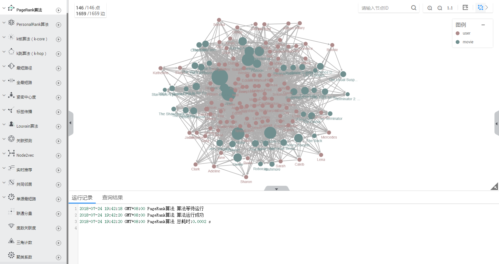

# 如何查询和分析图

本章节介绍如何使用图引擎服务（GES）对示例图数据进行查询和分析。流程如下所示：

1.  [创建图](#section1449515386571)
2.  [访问图](#section945154219574)
3.  [查询和分析图](#section1365204715713)
4.  [查看分析结果](#section13512145165718)

## 创建图

1.  进入图引擎服务管理控制台，单击“创建图“。
2.  在创建图页面，选择“区域“和“可用区“。

    “区域“：集群工作区域，可在页面左上角下拉栏选择，目前工作区域仅支持华北-北京一。

    “可用区“：可用区是使用独立电源和网络资源的物理区域。通过内部网络互联，再以物理方式进行隔离，提高了应用程序的可用性。建议您在不同的可用区下创建集群。再选择集群工作区域下关联的可用区。

3.  填写“图名称“。例如，demo。或采用系统默认名称。

    图名称的长度需满足如下条件。

    -   4～64个字符，且以字母开头。
    -   字母不区分大小写。
    -   只能包含字母、数字或下划线，不能包含其他特殊字符。

4.  “GES软件版本“：显示当前的版本号。
5.  选择网络信息，包含“虚拟私有云“、“子网“和“安全组“。
    -   “虚拟私有云“：VPC即虚拟私有云，是通过逻辑方式进行网络隔离，提供安全、隔离的网络环境。

        选择需要创建集群的VPC，单击“查看虚拟私有云“，可进入VPC服务查看已创建的VPC名称和ID。

        > **说明：**   
        >若没有VPC，请先创建一个新的VPC。  

    -   “子网“：通过子网提供与其他网络隔离的、可以独享的网络资源，以提高网络安全。

        选择需要创建集群的子网，可进入VPC服务查看VPC下已创建的子网名称和ID。

        > **说明：**   
        >子网在可用区内才会生效。  

    -   “安全组“：安全组是一个逻辑上的分组，为同一个VPC内具有相同安全保护需求并相互信任的弹性云服务器提供访问策略。单击“查看安全组“可了解安全组详情。

6.  选择公网访问的方式，包含“暂不使用“、“现在购买“和“使用已有“，用户可根据自身需求选择。
    -   “暂不使用“：不使用弹性IP的图实例并且不能与互联网互通，仅可通过私有网络中已部署的弹性云服务器连接当前图实例使用。
    -   “现在购买“：服务将自动为图实例分配独享带宽的弹性IP，以支持通过弹性IP从互联网对图实例进行访问。同时，服务将使用租户权限在当前项目下自动创建以ges\_agency\_default为前缀的授权委托以支持弹性IP的绑定处理。
    -   “使用已有“：为图实例绑定指定的弹性IP，通过弹性IP可以从互联网对图实例进行访问。

7.  填写图相关参数。

    只支持从OBS中选择元数据、边数据集、点数据集等数据，建议您提前将数据文件存储至OBS中，导入OBS的操作请参见OBS《[控制台指南](http://support.huaweicloud.com/usermanual-obs/zh-cn_topic_0045829088.html)》。图数据（包含元数据、边数据集、点数据集）需按照模板中的格式导入。模板中已包含一份电影数据的数据，可下载后直接导入。

    -   用途：企业生产或开发学习。
        -   企业生产：支持高可靠，高并发，适合企业生产及大规模应用时使用。
        -   开发学习：完整功能体验，适合开发者学习使用。

    -   图规格（边数）：以边为单位，根据用户当前的配额，系统会提示可创建的图的数量以及边数。企业生产和开发学习有不同的规格。
        -   企业生产：目前可选择“一百万”、“一千万”、“一亿”和“十亿”四种规格。
        -   开发学习：目前只有“一万”一种规格。

    -   元数据：图的元数据信息。如果没有元数据，可单击“创建新的元数据“创建，创建元数据的操作指导请参考[元数据管理](元数据管理.md)。
    -   边数据集：所有描述边的结构、标签和属性的信息构成了边数据集。
    -   点数据集：所有描述点的ID、标签和属性的信息构成了点数据集。

        > **说明：**   
        >点数据集和边数据集当前仅支持英文路径和文件夹格式。  

    **图 1**  图参数设置  
    

8.  单击“立即购买“。
9.  在“订单确认“页面，确认信息后，单击“提交订单“开始创建图。
10. 系统将自动跳转到“图管理“页面，您创建的图将展现在图列表中。

## 访问图

1.  在图管理页面，选中需访问的图，即demo。在操作列单击“访问“。

    **图 2**  图管理列表  
    

2.  页面进入图编辑器页面，您可以在此页面对当前图进行查询分析。如[图3](#fig54696754185831)所示。

    **图 3**  图编辑器  
    

## 查询和分析图

-   **通过Gremlin命令查询。**
    1.  在页面上方的Gremlin输入框中，输入查询命令，如g.V\(\).limit\(100\)。

        > **说明：**   
        >为了避免返回数据过大导致系统查询耗时过长，强烈建议您增加limit参数；并且，limit参数设置在1000以内展示效果更佳。  

        **图 4**  Gremlin查询  
        

    2.  按“回车“执行输入的Gremlin命令。查询结果分别在绘图区和结果区显示。

        **图 5**  Gremlin查询结果  
        

-   **通过选取算法、配置参数分析。**
    1.  在图编辑器页面左侧，展示当前系统支持的算法列表。从中选取需要分析的算法。

        **图 6**  算法列表  
        

    2.  选中需要使用的算法，单击展开算法参数配置，根据提示范围输入对应的取值。以PageRank算法为例，alpha为权重系数，取值0.85；covergence为收敛系数，取值0.00001；max\_iterations为最大迭代次数，取值1000；directed为是否考虑边的方向，默认为true。

        **图 7**  设置PageRank算法参数  
        

    3.  单击执行算法。分析结果分别在绘图区和结果区显示。

        **图 8**  分析结果  
        

## 查看分析结果

您可以在结果展示区查看运行记录和查询结果，或者单击右上角“导出“按钮，下载分析结果。

