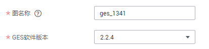
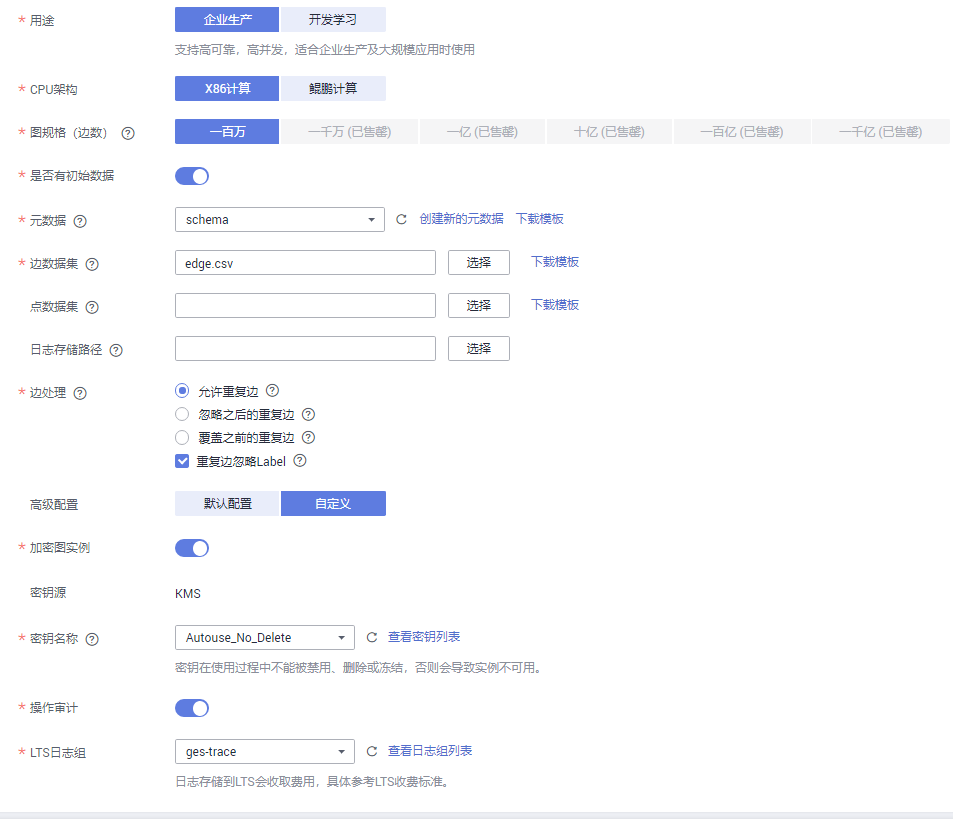
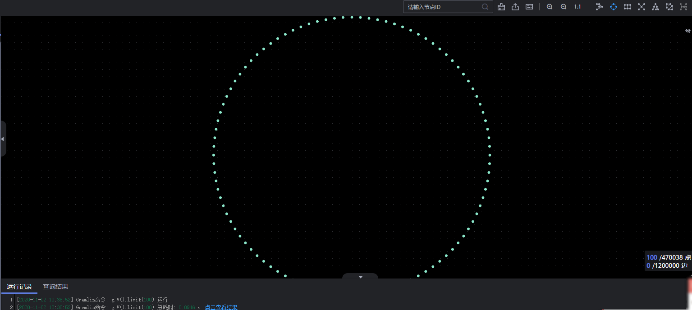
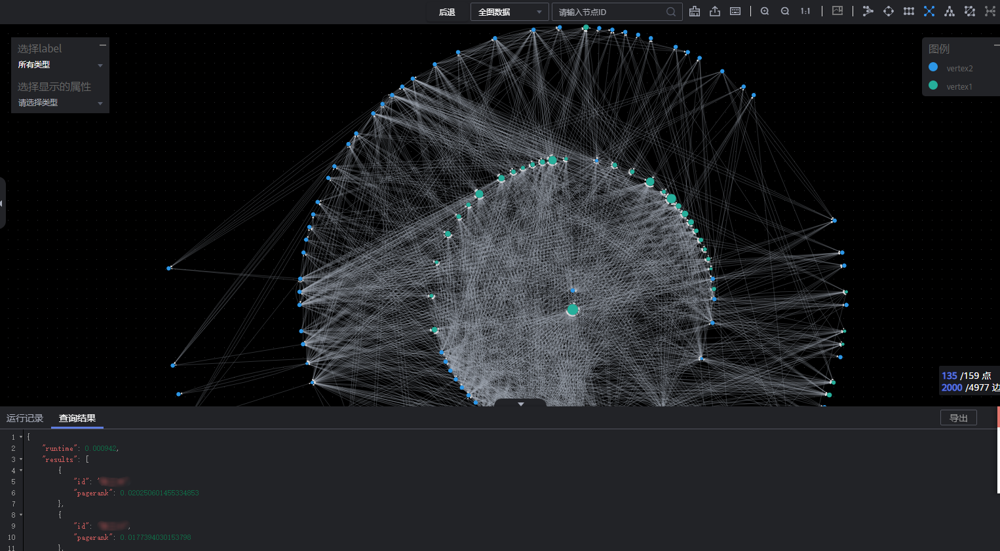

# 如何查询和分析图

本章节介绍如何使用图引擎服务（GES）对示例图数据进行查询和分析。流程如下所示：

[步骤1：创建图](#section1449515386571)

[步骤2：访问图](#section945154219574)

[步骤3：查询和分析图](#section1365204715713)

[步骤4：查看分析结果](#section13512145165718)

## 步骤1：创建图

1.  进入图引擎服务管理控制台，单击“创建图“。进入创建图页面。
2.  在创建图页面填写以下内容。
    -   选择“区域“。

        “区域“：集群工作区域，可在页面左上角下拉栏选择。

    -   设置图名称和软件版本。

        **图 1**  图名称和软件版本  
        

        -   填写“图名称“。例如，demo，或采用系统默认名称。

            图名称的长度需满足如下条件。

            -   4～64个字符，且必须以字母开头。
            -   字母不区分大小写。
            -   只能包含字母、数字、中划线或下划线，不能包含其他特殊字符。

        -   选择“GES软件版本“：可根据需要选择对应的版本号。

            > **说明：**   
            >目前只能选择当前默认的版本号。  

    -   选择网络信息，包含“虚拟私有云“、“子网“、“安全组“和“公网访问“。

        **图 2**  网络信息  
        

        -   “虚拟私有云“：VPC即虚拟私有云，是通过逻辑方式进行网络隔离，提供安全、隔离的网络环境。

            选择需要创建集群的VPC，单击“查看虚拟私有云“，可进入VPC服务查看已创建的VPC名称和ID。

            > **说明：**   
            >若没有VPC，请先创建一个新的VPC。  

        -   “子网“：通过子网提供与其他网络隔离的、可以独享的网络资源，以提高网络安全。

            选择需要创建集群的子网，可进入VPC服务查看VPC下已创建的子网名称和ID。

        -   “安全组“：安全组是一个逻辑上的分组，为同一个VPC内具有相同安全保护需求并相互信任的弹性云服务器提供访问策略。
            -   单击“如何配置安全组“可了解配置安全组的具体操作。
            -   单击“查看安全组“可了解安全组详情。

        -   选择公网访问的方式，包含“暂不使用“、“现在购买“和“使用已有“，用户可根据自身需求选择。
            -   “暂不使用“：不使用弹性IP的图实例并且不能与互联网互通，仅可通过私有网络中已部署的弹性云服务器连接当前图实例使用。
            -   “现在购买“：服务将自动为图实例分配独享带宽的弹性IP，以支持通过弹性IP从互联网对图实例进行访问。同时，服务将使用租户权限在当前项目下自动创建以ges\_agency\_default为前缀的授权委托以支持弹性IP的绑定处理。
            -   “使用已有“：为图实例绑定指定的弹性IP，通过弹性IP可以从互联网对图实例进行访问。

                单击“创建弹性IP“可进入VPC服务创建弹性公网IP。

    -   填写图相关参数。

        **图 3**  图相关参数  
        

        -   是否支持跨AZ高可用：默认关闭该选项，若打开该选项，可支持跨AZ（可用区）使用。
        -   用途：“企业生产“或“开发学习“。
            -   “企业生产“：支持高可靠，高并发，适合企业生产及大规模应用时使用。
            -   “开发学习“：完整功能体验，适合开发者学习使用。

        -   图规格（边数）：以边为单位，根据用户当前的配额，系统会提示可创建的图的数量以及边数。“企业生产“和“开发学习“有不同的规格。
            -   “企业生产“：目前可选择“一百万”、“一千万”、“一亿”，“十亿”，“一百亿”和“一千亿”六种规格。
            -   “开发学习“：目前只有“一万边”一种规格。

        -   是否有初始数据：默认关闭该选项，若打开该选项，则需选择下列参数。

            -   “元数据“：图的元数据信息。如果没有元数据，可单击“创建新的元数据“创建，创建元数据的操作指导请参考[元数据管理](元数据管理.md)。
            -   “边数据集“：组成此图的边数据描述，包括所有描述边的结构、标签和属性的信息。
            -   “点数据集“：组成此图的点的数据描述，包括所有描述点的ID、标签和属性的信息。如果未选择，则以边数据集中的点作为点数据集来源。

            > **说明：**   
            >-   边数据集和点数据集当前仅支持英文路径和文件夹格式。  
            >-   所选边数据文件或点数据文件中的“Label“和“Label“中“Property“的顺序需与所选元数据文件中的一致，否则会提示“所选边数据/点数据文件与元数据文件不匹配”而无法创建图。关于GES图数据的格式的具体内容可参考[图数据的格式](图数据的格式.md)。  

            -   “日志存储路径“：用于存储导入图过程中不符合元数据定义的点、边数据集和详细日志。存储在OBS中可能会产生费用，不使用时请及时删除。
            -   “边处理“：包括“允许重复边“，“忽略之后的重复边“，“覆盖之前的重复边“和“重复边忽略Label“。

            > **说明：**   
            >-   目前只支持从OBS中选择边数据集和点数据集，建议您提前将数据文件存储至OBS中，导入OBS的操作请参见OBS《[控制台指南](https://support.huaweicloud.com/usermanual-obs/zh-cn_topic_0045829088.html)》。  
            >-   图数据（包含元数据、边数据集、点数据集）需按照模板中的格式导入。模板中已包含一份电影数据，可单击“下载模板“后直接导入。  

3.  单击“立即购买“。进入“规格确认”页面。
4.  在“规格确认”页面，确认信息无误后，单击“提交“开始创建图。
5.  提交成功后系统将自动跳转到“完成“页面，单击“返回任务中心“可查看所创建图的状态及运行结果。

## 步骤2：访问图

1.  在“图管理“页面，在需访问的图，例如上述创建的demo，对应的“操作“列中单击“访问“。
2.  进入图编辑器页面，您可以在此页面对当前图进行查询分析。具体操作请参考[步骤3：查询和分析图](#section1365204715713)。

## 步骤3：查询和分析图

-   **通过Gremlin命令查询。**
    1.  在页面下方的Gremlin输入框中，输入查询命令，如g.V\(\).limit\(100\)。

        > **说明：**   
        >为了避免返回数据过大导致系统查询耗时过长，强烈建议您添加limit参数，并且将limit参数设置在1000以内，展示效果更佳。  

        **图 4**  Gremlin查询  
        

    2.  按“回车“执行输入的Gremlin命令。查询结果分别在绘图区和结果区显示。

        **图 5**  Gremlin查询结果  
        

-   **通过选取算法、配置参数分析。**
    1.  在图编辑器页面左侧，展示当前系统支持的算法列表。从中选取需要分析的算法。

        **图 6**  算法列表  
        

    2.  选中需要使用的算法，单击展开算法参数配置，根据提示范围输入对应的取值。以PageRank算法为例，“alpha“为权重系数，取值“0.85“；“covergence“为收敛系数，取值“0.00001“；“max\_iterations“为最大迭代次数，取值“1000“；“directed“为是否考虑边的方向，默认为“true“。

        **图 7**  设置PageRank算法参数  
        

    3.  单击执行算法。分析结果分别在绘图区和结果区显示。

        **图 8**  分析结果  
        

## 步骤4：查看分析结果

您可以在结果展示区查看“运行记录“和“查询结果“，或者单击右侧“导出“按钮，下载分析结果。

