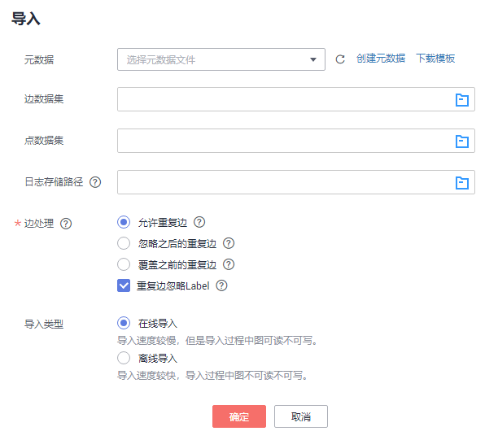

# 导入数据

## 操作场景

图引擎服务可在创建图时选择初始数据，也可在创建图完成后增量导入数据。

-   创建图时选择初始数据

    若创建图时选择了初始数据，则在创建图的过程中将默认导入图中，无需重复导入初始数据。

-   创建图完成后增量导入数据

    若创建图完成后，需要新增数据，可选择此处的“导入”功能进行增量导入。

> **说明：**   
>-   当前仅支持 1.1.8 以上版本的图的增量导入功能。  
>-   为防止系统重启时，不能正常恢复导入图数据，建议在使用图期间，不要删除存储在OBS中的数据。  
>-   数据列的分隔符默认为逗号，暂不支持自定义。  

以下为增量导入数据的操作步骤。

## 操作步骤

1.  登录图引擎服务管理控制台。
2.  在左侧导航栏，选择“图管理“。
3.  在图管理列表中，选择需要导入数据的图，在“操作“列选择“导入“。
4.  在弹出的导入提示框中，选择以下参数。

    -   元数据：可选择已有元数据或创建新的元数据，具体操作可参考[元数据管理](元数据管理.md)。
    -   边数据集：选择对应的边数据集。
    -   点数据集：选择对应的点数据集。若不选择，则以边数据集中的点作为点数据集来源。
    -   日志存储路径：用于存储导入图过程中不符合元数据定义的点、边数据集和详细日志。存储在OBS中可能会产生费用，请及时删除。
    -   边处理：包括“允许重复边”，“忽略之后的重复边”，“覆盖之前的重复边”和“重复边忽略Label”。具体含义请参考[◦“边处理”：包括“允许重复边”，“忽略之后的重...](如何查询和分析图.md#li34305547428)。
    -   导入类型：包括“在线导入”和“离线导入”。

    **图 1**  导入数据  
    

5.  单击“确定“完成导入。

