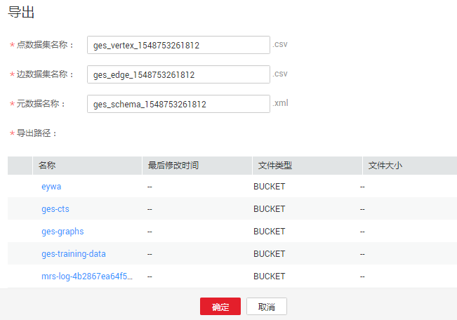

# 导出图

## 操作场景

如果需要把图数据导出到本地，您可以执行导出图的操作。

> **说明：**   
>当前仅支持 1.0.3 以上版本的图的导出，1.0.3版本之前版本的图请升级后再执行此操作。  

## 操作步骤

1.  登录图引擎服务管理控制台。
2.  在左侧导航栏，选择“图管理“。
3.  在图管理列表中，选择需导出的图，在“操作“列选择“更多“\>“导出“。

    **图 1**  导出图  
    

4.  在弹出的导出图页面下方，选择存储路径。
5.  单击“确定“，系统开始执行导出操作，过一段时间后，可以到选择的OBS路径下查看是否导出成功。

