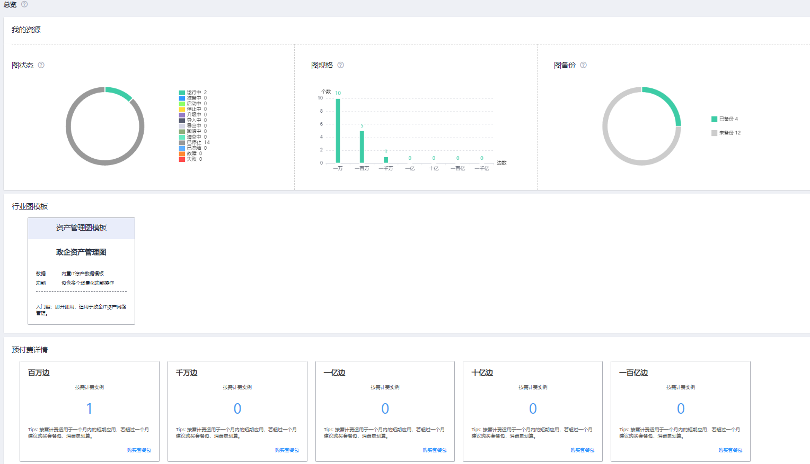

# 总览

系统总览页面展示了“我的资源”信息，包括图状态、图规格、图备份及预付费详情，可以帮助您快速了解已有图的信息和计费详情。

**图 1**  总览信息  

## 图状态

图状态展示了处于不同状态的图数量，当前系统支持9种状态。

**表 1**  状态说明

<table><thead align="left"><tr id="row1783610368371"><th class="cellrowborder" valign="top" width="22%" id="mcps1.2.3.1.1">
状态

</th>
<th class="cellrowborder" valign="top" width="78%" id="mcps1.2.3.1.2">
说明

</th>
</tr>
</thead>
<tbody><tr id="row128361836103718"><td class="cellrowborder" valign="top" width="22%" headers="mcps1.2.3.1.1 ">
运行中

</td>
<td class="cellrowborder" valign="top" width="78%" headers="mcps1.2.3.1.2 ">
表示正在运行的图，处于该状态的图可访问。

</td>
</tr>
<tr id="row48361736173713"><td class="cellrowborder" valign="top" width="22%" headers="mcps1.2.3.1.1 ">
准备中

</td>
<td class="cellrowborder" valign="top" width="78%" headers="mcps1.2.3.1.2 ">
表示正在创建的图，正在加载数据。

</td>
</tr>
<tr id="row54421454183814"><td class="cellrowborder" valign="top" width="22%" headers="mcps1.2.3.1.1 ">
停止中

</td>
<td class="cellrowborder" valign="top" width="78%" headers="mcps1.2.3.1.2 ">
表示正在停止的图。

</td>
</tr>
<tr id="row544315419387"><td class="cellrowborder" valign="top" width="22%" headers="mcps1.2.3.1.1 ">
升级中

</td>
<td class="cellrowborder" valign="top" width="78%" headers="mcps1.2.3.1.2 ">
表示正在升级的图。

</td>
</tr>
<tr id="row7443145423819"><td class="cellrowborder" valign="top" width="22%" headers="mcps1.2.3.1.1 ">
回滚中

</td>
<td class="cellrowborder" valign="top" width="78%" headers="mcps1.2.3.1.2 ">
表示正在回滚的图。

</td>
</tr>
<tr id="row13615548194017"><td class="cellrowborder" valign="top" width="22%" headers="mcps1.2.3.1.1 ">
已停止

</td>
<td class="cellrowborder" valign="top" width="78%" headers="mcps1.2.3.1.2 ">
表示已停止的图，处于该状态的图不可继续访问。停止状态的图可以重新启动。

</td>
</tr>
<tr id="row1690519446404"><td class="cellrowborder" valign="top" width="22%" headers="mcps1.2.3.1.1 ">
已冻结

</td>
<td class="cellrowborder" valign="top" width="78%" headers="mcps1.2.3.1.2 ">
表示用户的账户和资源被冻结。详情可参考<a href="https://support.huaweicloud.com/account_faq/zh-cn_topic_100012.html" target="_blank" rel="noopener noreferrer">账号中心</a>。

 说明： 

用户账户被冻结后，只能做删除操作。

</td>
</tr>
<tr id="row2905444164015"><td class="cellrowborder" valign="top" width="22%" headers="mcps1.2.3.1.1 ">
故障

</td>
<td class="cellrowborder" valign="top" width="78%" headers="mcps1.2.3.1.2 ">
表示出现故障的图，处于该状态的图不可访问。

</td>
</tr>
<tr id="row6196268319915"><td class="cellrowborder" valign="top" width="22%" headers="mcps1.2.3.1.1 ">
失败

</td>
<td class="cellrowborder" valign="top" width="78%" headers="mcps1.2.3.1.2 ">
表示创建失败的图。

</td>
</tr>
</tbody>
</table>

## 图规格

图规格展示了不同规格的图数量，当前系统支持7种规格。

**表 2**  规格介绍

<table><thead align="left"><tr id="row1260143894420"><th class="cellrowborder" valign="top" width="22%" id="mcps1.2.3.1.1">
规格

</th>
<th class="cellrowborder" valign="top" width="78%" id="mcps1.2.3.1.2">
说明

</th>
</tr>
</thead>
<tbody><tr id="row16874149184912"><td class="cellrowborder" valign="top" width="22%" headers="mcps1.2.3.1.1 ">
一万

</td>
<td class="cellrowborder" valign="top" width="78%" headers="mcps1.2.3.1.2 ">
表示允许创建的图的边数不超过一万。

</td>
</tr>
<tr id="row326093804417"><td class="cellrowborder" valign="top" width="22%" headers="mcps1.2.3.1.1 ">
一百万

</td>
<td class="cellrowborder" valign="top" width="78%" headers="mcps1.2.3.1.2 ">
表示允许创建的图的边数不超过一百万。

</td>
</tr>
<tr id="row11261123814412"><td class="cellrowborder" valign="top" width="22%" headers="mcps1.2.3.1.1 ">
一千万

</td>
<td class="cellrowborder" valign="top" width="78%" headers="mcps1.2.3.1.2 ">
表示允许创建的图的边数不超过一千万。

</td>
</tr>
<tr id="row526123884418"><td class="cellrowborder" valign="top" width="22%" headers="mcps1.2.3.1.1 ">
一亿

</td>
<td class="cellrowborder" valign="top" width="78%" headers="mcps1.2.3.1.2 ">
表示允许创建的图的边数不超过一亿。

</td>
</tr>
<tr id="row102614385442"><td class="cellrowborder" valign="top" width="22%" headers="mcps1.2.3.1.1 ">
十亿

</td>
<td class="cellrowborder" valign="top" width="78%" headers="mcps1.2.3.1.2 ">
表示允许创建的图的边数不超过十亿。

</td>
</tr>
<tr id="row184851305010"><td class="cellrowborder" valign="top" width="22%" headers="mcps1.2.3.1.1 ">
一百亿

</td>
<td class="cellrowborder" valign="top" width="78%" headers="mcps1.2.3.1.2 ">
表示允许创建的图的边数不超过百亿。

</td>
</tr>
<tr id="row62611738124414"><td class="cellrowborder" valign="top" width="22%" headers="mcps1.2.3.1.1 ">
一千亿

</td>
<td class="cellrowborder" valign="top" width="78%" headers="mcps1.2.3.1.2 ">
表示允许创建的图的边数不超过千亿。

</td>
</tr>
</tbody>
</table>

## 图备份

为防止数据丢失，系统支持对图数据进行备份。当前页面展示了已备份的图数量，以及未备份的图数量。

**表 3**  备份状态介绍

<table><thead align="left"><tr id="row171302517466"><th class="cellrowborder" valign="top" width="22%" id="mcps1.2.3.1.1">
备份状态

</th>
<th class="cellrowborder" valign="top" width="78%" id="mcps1.2.3.1.2">
说明

</th>
</tr>
</thead>
<tbody><tr id="row141301051134612"><td class="cellrowborder" valign="top" width="22%" headers="mcps1.2.3.1.1 ">
已备份

</td>
<td class="cellrowborder" valign="top" width="78%" headers="mcps1.2.3.1.2 ">
已完成备份的图数量。

</td>
</tr>
<tr id="row713005112461"><td class="cellrowborder" valign="top" width="22%" headers="mcps1.2.3.1.1 ">
未备份

</td>
<td class="cellrowborder" valign="top" width="78%" headers="mcps1.2.3.1.2 ">
未备份的图数量。

</td>
</tr>
</tbody>
</table>

## 预付费详情

预付费详情展示了不同规格的购买路径，实例个数及到期时间。

