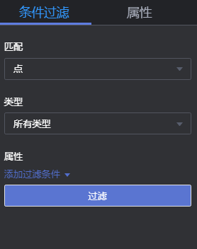

# 条件过滤

## 操作场景

为了方便用户对图数据的分析，可以通过设置条件过滤，对图数据进行进一步的过滤分析。

## 操作步骤

1.  进入图引擎编辑器页面，详细操作请参见[访问图引擎编辑器](访问图引擎编辑器.md)。
2.  在“属性及条件过滤“区，设置条件，然后单击“过滤“。
    -   匹配：默认选中点，表示要过滤的是点或者边。
    -   类型：默认选中所有类型，下拉框中显示点边所有类型，类型由用户上传的元数据文件中定义。
    -   添加过滤条件：属性在用户上传的元数据文件中定义。选中一个属性，并选择约束条件（包含“小于、大于、等于、不等于、在范围、存在、不存在、大于或等于、小于或等于”）。此处可添加多条过滤条件，也可单击“删除“，删除已设置的过滤条件。

        **图 1**  设置条件过滤  
        

3.  运行结束后，过滤结果将呈现在绘图区以及结果查询区。

