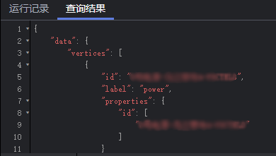
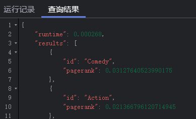

# 查看查询结果

## 操作场景

数据分析结束后，您可以直接在绘图区查看结果或者在“查询结果“页签获取结果信息。

## 操作步骤

1.  进入图引擎编辑器页面，详细操作请参见[访问图引擎编辑器](访问图引擎编辑器.md)。
2.  在执行Gremlin查询或算法分析之后，在“查询结果“页签下，展示查询结果。

    当返回结果很大，绘图区和结果区无法完全展示时，单击右上角“导出“按钮，可下载分析结果。

    -   执行Gremlin命令，显示执行结果，例如，输入查询命令g.V\(\).limit\(100\)，查询结果为：

        **图 1**  查询Gremlin命令结果  
        

    -   执行算法，显示运行时间，执行结果，例如，执行PageRank算法，查询结果为：

        **图 2**  查询算法结果  
        

