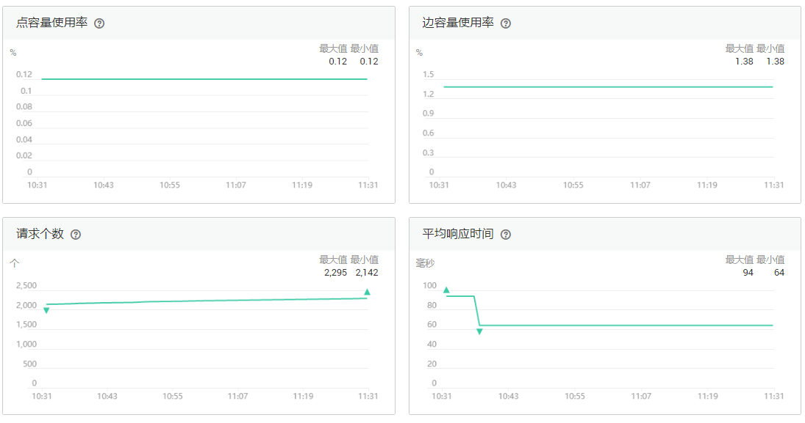
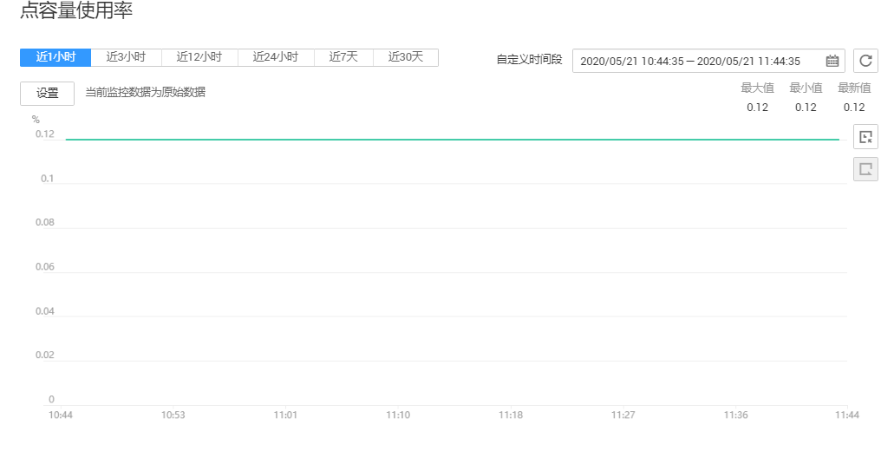

# 查看监控指标

## 操作场景

云监控服务可以对GES的运行状态进行日常监控。您可以通过云监控管理控制台，直观地查看各项监控指标。

由于监控数据的获取与传输会花费一定时间，因此，云监控显示的是当前时间5～10分钟前的状态。如果您的在线服务刚刚创建完成，请等待5～10分钟后查看监控数据。

## 前提条件

-   GES在线服务正常运行。
-   在线服务已正常运行一段时间（约10分钟）。
-   对于新创建的在线服务需要等待一段时间，才能查看上报的监控数据和监控视图。
-   故障、删除状态的在线服务，无法在云监控中查看其监控指标。当在线服务再次启动或恢复后，即可正常查看。

## 操作步骤

1.  登录管理控制台。
2.  在左侧导航栏中选择“图管理“，单击图管理操作列中的“更多 \> 查看监控指标“，页面会跳转到云监控服务的界面。
3.  在图引擎监控页面，可查看所有监控指标的小图。

    **图 1**  查看监控指标  
    

4.  更长时间范围监控曲线请在监控视图中点击进入大图模式查看。

    **图 2**  大图模式监控数据  
    

5.  系统提供了监控固定时长和自动刷新两种方式。
    1.  固定时长包括最近1小时、3小时、12小时一共3个时间段，作为用户监控周期。
    2.  自动刷新时长的周期为60s，作为用户监控周期。

