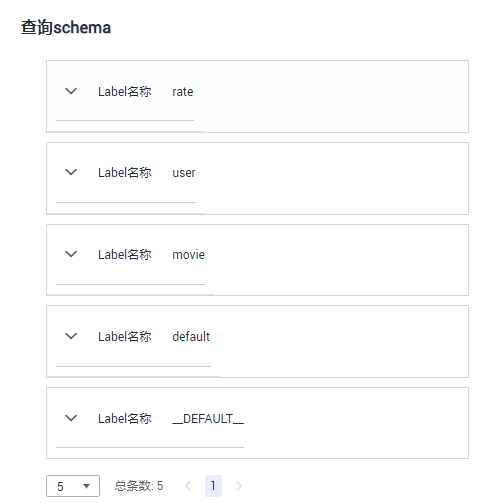
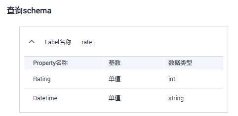

# 查询schema

## 操作场景

查看图的元数据，元数据中包含了标签（Label）和属性（Property）。

## 操作步骤

1.  登录管理控制台。
2.  在左侧导航栏中选择“图管理“，单击图管理操作列中的“更多 \> 查询schema“，会弹出一个窗口显示当前图的元数据包含的标签（Label）。

    **图 1**  查询schema  
    

3.  想要查看标签中包含的属性，点击即可查看每个标签下的单个属性。

    **图 2**  查看标签中属性  
    

