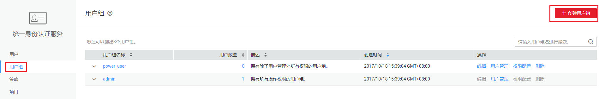

# 用户组配置

## 操作场景

您可以创建、管理用户组以及查看用户组是否已关联权限。

## 操作步骤

1.  对用户组进行配置之前，请先了解[用户组](https://support.huaweicloud.com/productdesc-iam/iam_01_0023.html#section5)的概念。
2.  在“用户组配置“页面单击右上角“创建用户组“，进入创建用户组页面。

    **图 1**  用户组配置  
    

3.  在创建用户组页面，您可以设置用户组名称和选择组员。

    -   “用户组名称“：您可以为要创建的用户组设置名称或者使用默认的名称。
    -   “组员选择“：您账号下所有创建的IAM用户都会显示在可选组员里，选择加入该用户组的组员。

    **图 2**  创建用户组  
    

4.  单击右下角“保存“，完成用户组创建。创建完成的用户组会显示在“用户组配置“页面，您可以进行编辑或者删除操作。

    **图 3**  用户组配置  
    

    > **说明：** 
    >创建完成的用户组，若已关联细粒度权限，不能进行删除操作。

