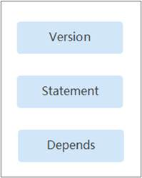

# 策略语法：RBAC<a name="ges_01_0071"></a>

## 策略结构<a name="section766995911819"></a>

策略结构包括：策略版本号（Version）、策略授权语句（Statement）和策略依赖（Depends）。

**图 1**  RBAC策略结构<a name="fig1880665914816"></a>  


## 策略语法<a name="section36766598814"></a>

如下以GES服务的“GES Administraor”为例，说明RBAC策略语法。

```
{
    "Version": "1.0",
    "Statement": [
        {
            "Action": [
                "GES:GES:*"
            ],
            "Effect": "Allow"
        }
    ],
    "Depends": [
        {
            "catalog": "BASE",
            "display_name": "Server Administrator"
        },
        {
            "catalog": "BASE",
            "display_name": "Tenant Guest"
        }
    ]
}
```

**表 1**  参数说明

<a name="table146793596811"></a>
<table><thead align="left"><tr id="row188071959785"><th class="cellrowborder" colspan="2" valign="top" id="mcps1.2.5.1.1"><p id="p48071759981"><a name="p48071759981"></a><a name="p48071759981"></a>参数</p>
</th>
<th class="cellrowborder" valign="top" id="mcps1.2.5.1.2"><p id="p1680718595814"><a name="p1680718595814"></a><a name="p1680718595814"></a>含义</p>
</th>
<th class="cellrowborder" valign="top" id="mcps1.2.5.1.3"><p id="p138075591688"><a name="p138075591688"></a><a name="p138075591688"></a>值</p>
</th>
</tr>
</thead>
<tbody><tr id="row208073597813"><td class="cellrowborder" colspan="2" valign="top" headers="mcps1.2.5.1.1 "><p id="p88079591881"><a name="p88079591881"></a><a name="p88079591881"></a>Version</p>
</td>
<td class="cellrowborder" valign="top" headers="mcps1.2.5.1.2 "><p id="p14807259485"><a name="p14807259485"></a><a name="p14807259485"></a>策略的版本</p>
</td>
<td class="cellrowborder" valign="top" headers="mcps1.2.5.1.3 "><p id="p880716593813"><a name="p880716593813"></a><a name="p880716593813"></a>RBAC策略为“1.0”</p>
</td>
</tr>
<tr id="row380718596815"><td class="cellrowborder" rowspan="2" valign="top" width="11.29112911291129%" headers="mcps1.2.5.1.1 "><p id="p78076598819"><a name="p78076598819"></a><a name="p78076598819"></a>Statement</p>
</td>
<td class="cellrowborder" valign="top" width="13.851385138513853%" headers="mcps1.2.5.1.1 "><p id="p168081595814"><a name="p168081595814"></a><a name="p168081595814"></a>Action</p>
</td>
<td class="cellrowborder" valign="top" width="22.352235223522353%" headers="mcps1.2.5.1.2 "><p id="p1980812591388"><a name="p1980812591388"></a><a name="p1980812591388"></a>定义对GES的具体操作。</p>
</td>
<td class="cellrowborder" valign="top" width="52.5052505250525%" headers="mcps1.2.5.1.3 "><p id="p08081659187"><a name="p08081659187"></a><a name="p08081659187"></a>格式为：服务名:资源类型:操作</p>
<p id="p1480815593812"><a name="p1480815593812"></a><a name="p1480815593812"></a>"GES:*:*"：表示对GES的所有操作，其中GES为服务名称；“*”为通配符，表示对所有的资源类型可以执行所有操作。</p>
</td>
</tr>
<tr id="row68081259184"><td class="cellrowborder" valign="top" headers="mcps1.2.5.1.1 "><p id="p180845913814"><a name="p180845913814"></a><a name="p180845913814"></a>Effect</p>
</td>
<td class="cellrowborder" valign="top" headers="mcps1.2.5.1.1 "><p id="p28081959381"><a name="p28081959381"></a><a name="p28081959381"></a>定义Action中所包含的具体操作是否允许执行。</p>
</td>
<td class="cellrowborder" valign="top" headers="mcps1.2.5.1.2 "><a name="ul4808175920818"></a><a name="ul4808175920818"></a><ul id="ul4808175920818"><li>Allow：允许执行</li><li>Deny：不允许执行</li></ul>
</td>
</tr>
<tr id="row208087597813"><td class="cellrowborder" rowspan="2" valign="top" width="11.29112911291129%" headers="mcps1.2.5.1.1 "><p id="p7808559589"><a name="p7808559589"></a><a name="p7808559589"></a>Depends</p>
</td>
<td class="cellrowborder" valign="top" width="13.851385138513853%" headers="mcps1.2.5.1.1 "><p id="p1680885916811"><a name="p1680885916811"></a><a name="p1680885916811"></a>catalog</p>
</td>
<td class="cellrowborder" valign="top" width="22.352235223522353%" headers="mcps1.2.5.1.2 "><p id="p15808259888"><a name="p15808259888"></a><a name="p15808259888"></a>依赖的其他策略的所属目录。</p>
</td>
<td class="cellrowborder" valign="top" width="52.5052505250525%" headers="mcps1.2.5.1.3 "><p id="p128086591988"><a name="p128086591988"></a><a name="p128086591988"></a>服务名称</p>
<p id="p680812591982"><a name="p680812591982"></a><a name="p680812591982"></a>例如：BASE</p>
</td>
</tr>
<tr id="row1480895915810"><td class="cellrowborder" valign="top" headers="mcps1.2.5.1.1 "><p id="p680810591188"><a name="p680810591188"></a><a name="p680810591188"></a>display_name</p>
</td>
<td class="cellrowborder" valign="top" headers="mcps1.2.5.1.1 "><p id="p180915915818"><a name="p180915915818"></a><a name="p180915915818"></a>依赖的其他权限的名称。</p>
</td>
<td class="cellrowborder" valign="top" headers="mcps1.2.5.1.2 "><p id="p88093591484"><a name="p88093591484"></a><a name="p88093591484"></a>权限名称</p>
<p id="p4809205915816"><a name="p4809205915816"></a><a name="p4809205915816"></a>例如：Server Administrator</p>
</td>
</tr>
</tbody>
</table>

