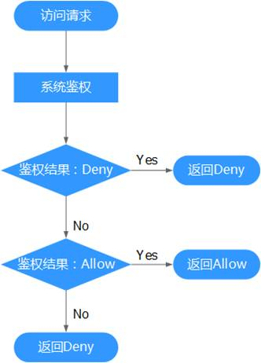

# 策略语法：细粒度策略<a name="ges_01_0074"></a>

开通细粒度访问控制公测后，在“统一身份认证”页面的左侧导航树单击“策略”，可以查看[所有系统策略](https://support.huaweicloud.com/usermanual-permissions/zh-cn_topic_0063498930.html)和自定义策略。

## 策略内容<a name="section1969413551216"></a>

给用户组选择策略时，单击策略下方的，可以查看策略的详细内容，以“Agent Operator”为例。

**图 1**  策略<a name="fig868602412187"></a>  


**图 2**  策略详情<a name="fig118871852151813"></a>  


作用范围：给用户组授予该策略时，选择的授权区域。

-   全局级服务：服务部署时不区分物理区域，为全局级服务。在全局项目中进行授权，访问该服务时，不需要切换区域。

    **图 3**  全局级服务<a name="fig760742711236"></a>  
    

    > **说明：**   
    >对象存储服务（OBS）与其他服务隔离部署，授权时需要在全局服务区域，对象存储服务项目中进行。  

-   项目级服务：服务部署时通过物理区域划分，为项目级服务。在除全局区域外的其他区域中授权，并且只在授权区域生效，如果需要所有区域都生效，则所有区域都需要进行授权操作,，例如弹性云服务器（ECS）。IAM用户访问该服务时，需要先切换到授权区域。

全局级服务/项目级服务：服务部署在所有区域，在所有区域中都可以授权，例如SSL证书管理（SCM）。

## 策略结构<a name="section19213979419"></a>

策略结构包括：Version（策略版本号）和Statement（策略权限语句），其中Statement可以有多个，表示不同的授权项。

**图 4**  细粒度策略结构<a name="fig19448177184118"></a>  


## 策略语法<a name="section321719715411"></a>

如下以“GES Viewer策略”为例，说明策略语法组成。

```
{
        "Version": "1.1",
        "Statement": [
                {
                        "Effect": "Allow",
                        "Action": [
                                "ges:*:get*",
                                "ges:*:list*",
                                "ecs:*:get*",
                                "ecs:*:list*",
                                "vpc:*:get*",
                                "vpc:*:list*"
                        ]
                }
        ]
}
```

**表 1**  参数说明

<a name="table6773124962518"></a>
<table><thead align="left"><tr id="row677484992514"><th class="cellrowborder" valign="top" width="13.77137713771377%" id="mcps1.2.4.1.1"><p id="p577464962514"><a name="p577464962514"></a><a name="p577464962514"></a>参数</p>
</th>
<th class="cellrowborder" valign="top" width="37.833783378337834%" id="mcps1.2.4.1.2"><p id="p277454915253"><a name="p277454915253"></a><a name="p277454915253"></a>含义</p>
</th>
<th class="cellrowborder" valign="top" width="48.394839483948395%" id="mcps1.2.4.1.3"><p id="p17774194992513"><a name="p17774194992513"></a><a name="p17774194992513"></a>值</p>
</th>
</tr>
</thead>
<tbody><tr id="row777410492252"><td class="cellrowborder" valign="top" width="13.77137713771377%" headers="mcps1.2.4.1.1 "><p id="p18774154911254"><a name="p18774154911254"></a><a name="p18774154911254"></a>Version</p>
</td>
<td class="cellrowborder" valign="top" width="37.833783378337834%" headers="mcps1.2.4.1.2 "><p id="p11774134962511"><a name="p11774134962511"></a><a name="p11774134962511"></a>标识策略的版本号，主要用于区分Role-Based Access Control（RBAC）策略和细粒度策略。</p>
</td>
<td class="cellrowborder" valign="top" width="48.394839483948395%" headers="mcps1.2.4.1.3 "><a name="ul1775919538267"></a><a name="ul1775919538267"></a><ul id="ul1775919538267"><li>1.0：RBAC策略。RBAC策略是将服务作为一个整体进行授权，授权后，用户可以拥有这个服务的所有权限。</li><li>1.1：细粒度策略。相比RBAC策略，细粒度策略基于服务的API接口进行权限拆分，授权更加精细。授权后，用户可以对这个服务执行特定的操作。细粒度策略包括系统预置和用户自定义两种。</li></ul>
</td>
</tr>
<tr id="row11774124962519"><td class="cellrowborder" rowspan="4" valign="top" width="13.77137713771377%" headers="mcps1.2.4.1.1 "><p id="p10774184914259"><a name="p10774184914259"></a><a name="p10774184914259"></a>Statement</p>
<p id="p19775124914258"><a name="p19775124914258"></a><a name="p19775124914258"></a></p>
<p id="p1377564910259"><a name="p1377564910259"></a><a name="p1377564910259"></a></p>
<p id="p9775149112520"><a name="p9775149112520"></a><a name="p9775149112520"></a></p>
</td>
<td class="cellrowborder" rowspan="4" valign="top" width="37.833783378337834%" headers="mcps1.2.4.1.2 "><p id="p1077410493258"><a name="p1077410493258"></a><a name="p1077410493258"></a>策略授权语句，描述策略的详细信息，包含Action（授权项）、Effect（作用）、Resource（资源类型）和Condition（条件）。</p>
<p id="p1477544992514"><a name="p1477544992514"></a><a name="p1477544992514"></a></p>
<p id="p187751849152519"><a name="p187751849152519"></a><a name="p187751849152519"></a></p>
<p id="p677518491253"><a name="p677518491253"></a><a name="p677518491253"></a></p>
</td>
<td class="cellrowborder" valign="top" width="48.394839483948395%" headers="mcps1.2.4.1.3 "><p id="p1563162416357"><a name="p1563162416357"></a><a name="p1563162416357"></a>Action：对资源的具体操作权限。</p>
<a name="ul24881728173519"></a><a name="ul24881728173519"></a><ul id="ul24881728173519"><li>格式为：服务名:资源类型:操作，支持单个或多个操作权限，支持通配符号*，通配符号表示所有。</li><li>示例："ges:jobs:get"，其中ges为服务名，jobs为资源类型，get为操作，该授权项表示对GES作业的查看权限。</li></ul>
</td>
</tr>
<tr id="row57751949202511"><td class="cellrowborder" valign="top" headers="mcps1.2.4.1.1 "><p id="p1068611209358"><a name="p1068611209358"></a><a name="p1068611209358"></a>Effect：定义Action中的操作权限是否允许执行。</p>
<p id="p142479429306"><a name="p142479429306"></a><a name="p142479429306"></a>作用包含两种：</p>
<a name="ul132601547183017"></a><a name="ul132601547183017"></a><ul id="ul132601547183017"><li>Allow（允许执行）</li><li>Deny（不允许执行）</li></ul>
<div class="note" id="note694510813338"><a name="note694510813338"></a><a name="note694510813338"></a><span class="notetitle"> 说明： </span><div class="notebody"><p id="p8972882331"><a name="p8972882331"></a><a name="p8972882331"></a>当同一个Action的Effect既有Allow又有Deny时，遵循Deny优先的原则。</p>
</div></div>
</td>
</tr>
<tr id="row9775154913256"><td class="cellrowborder" valign="top" headers="mcps1.2.4.1.1 "><p id="p0775549122512"><a name="p0775549122512"></a><a name="p0775549122512"></a>Resource：策略所作用的资源。</p>
<a name="ul54533913617"></a><a name="ul54533913617"></a><ul id="ul54533913617"><li>格式为：服务名:region:domainId:资源类型:资源路径, 通配符号*表示所有。</li><li>示例：<a name="ul59224517365"></a><a name="ul59224517365"></a><ul id="ul59224517365"><li>"obs:*:*:bucket:*": 表示所有的OBS桶。</li><li>"obs:*:*:object:my-bucket/my-object/*": 表示my-bucket桶my-object目录下的所有对象。</li></ul>
</li></ul>
</td>
</tr>
<tr id="row2077511499251"><td class="cellrowborder" valign="top" headers="mcps1.2.4.1.1 "><p id="p197751149192513"><a name="p197751149192513"></a><a name="p197751149192513"></a>Condition：使策略生效的特定条件。</p>
<a name="ul1697717833714"></a><a name="ul1697717833714"></a><ul id="ul1697717833714"><li>格式为：条件运算符: {条件名：[条件值1, 条件值2]}。</li><li>示例:<p id="p1148071673715"><a name="p1148071673715"></a><a name="p1148071673715"></a>"StringEndWithIfExists":{"g:UserName":["specialCharactor"]}：表示当用户输入的用户名以"specialCharactor"结尾时该条statement生效。</p>
</li></ul>
</td>
</tr>
</tbody>
</table>

## 检查规则<a name="section17298117184116"></a>

当用户被授予多个策略，或者一个策略中包含多个授权语句，这些策略中既有Allow又有Deny的授权语句时，遵循Deny优先的原则。在用户访问资源时，权限检查逻辑如下。

**图 5**  系统鉴权逻辑图<a name="fig04511576415"></a>  


> **说明：**   
>每条策略做评估时， Action之间是或\(or\)的关系。  

1.  用户访问系统，发起操作请求。
2.  系统评估用户被授予的访问策略，鉴权开始。
3.  在用户被授予的访问策略中，系统将优先寻找显式拒绝指令。如找到一个适用的显式拒绝，系统将返回Deny决定。
4.  如果没有找到显式拒绝指令，系统将寻找适用于请求的任何Allow指令。如果找到一个显式允许指令，系统将返回Allow决定。
5.  如果找不到显式允许，最终决定为Deny，鉴权结束。

