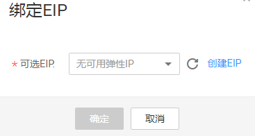

# 绑定EIP

## 操作场景

如果需要通过公网访问GES服务，您可以通过绑定弹性公网IP（简称EIP）来实现。

## 操作步骤

1.  登录图引擎服务管理控制台。
2.  在左侧导航栏，选择“图管理“。
3.  在图管理列表中，选择需绑定EIP图，在“操作“列选择“更多“\>“绑定EIP“。
4.  在弹出的“绑定EIP“页面中，选择可用EIP。

    若无可用EIP，请单击“创建EIP“，购买并创建成功后，单击刷新，再选择使用。

    **图 1**  绑定EIP  
    

5.  单击“确定“，完成绑定。

