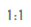
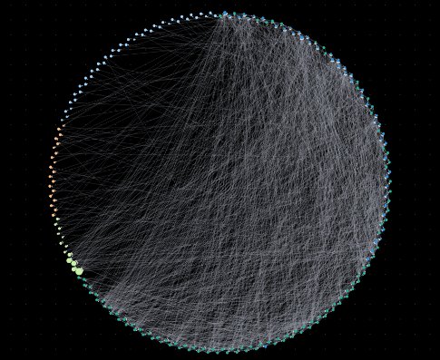
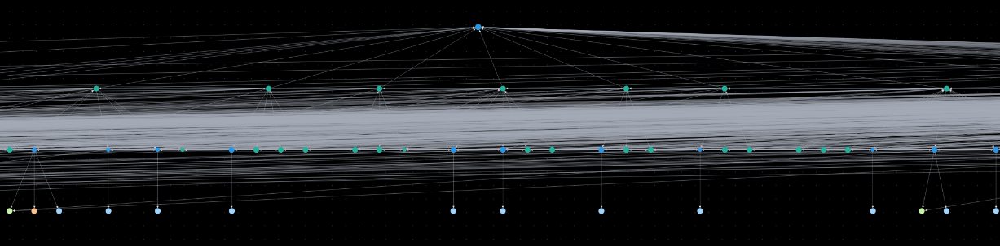

# 编辑器页面介绍

编辑器页面分为算法区、Gremlin查询区、绘图区、结果展示区、属性及过滤区。

**图 1**  编辑器  

**表 1**  区域说明

<table><thead align="left"><tr id="row104208264207"><th class="cellrowborder" valign="top" width="8%" id="mcps1.2.4.1.1">
序号

</th>
<th class="cellrowborder" valign="top" width="18.4%" id="mcps1.2.4.1.2">
区域名称

</th>
<th class="cellrowborder" valign="top" width="73.6%" id="mcps1.2.4.1.3">
说明

</th>
</tr>
</thead>
<tbody><tr id="row114201326132015"><td class="cellrowborder" valign="top" width="8%" headers="mcps1.2.4.1.1 ">
1

</td>
<td class="cellrowborder" valign="top" width="18.4%" headers="mcps1.2.4.1.2 ">
算法区

</td>
<td class="cellrowborder" valign="top" width="73.6%" headers="mcps1.2.4.1.3 ">
显示了GES服务支持的所有算法，且可在此区域设置各算法相关的属性。算法区功能介绍如<a href="#table187823443503">表2</a>所示。

</td>
</tr>
<tr id="row1842132692013"><td class="cellrowborder" valign="top" width="8%" headers="mcps1.2.4.1.1 ">
2

</td>
<td class="cellrowborder" valign="top" width="18.4%" headers="mcps1.2.4.1.2 ">
Gremlin查询区

</td>
<td class="cellrowborder" valign="top" width="73.6%" headers="mcps1.2.4.1.3 ">
Gremlin搜索框，可以在编辑区域输入查询语句执行查询操作。

</td>
</tr>
<tr id="row1042110268208"><td class="cellrowborder" valign="top" width="8%" headers="mcps1.2.4.1.1 ">
3

</td>
<td class="cellrowborder" valign="top" width="18.4%" headers="mcps1.2.4.1.2 ">
绘图区

</td>
<td class="cellrowborder" valign="top" width="73.6%" headers="mcps1.2.4.1.3 ">
图数据的可视化展示区。绘图区预置了快捷操作，方便您对图数据进行分析。

绘图区详细功能介绍如<a href="#table13009775611">表3</a>所示。

</td>
</tr>
<tr id="row642182692016"><td class="cellrowborder" valign="top" width="8%" headers="mcps1.2.4.1.1 ">
4

</td>
<td class="cellrowborder" valign="top" width="18.4%" headers="mcps1.2.4.1.2 ">
结果展示区

</td>
<td class="cellrowborder" valign="top" width="73.6%" headers="mcps1.2.4.1.3 ">
包含两个页签：

<ul id="ul1458143519245"><li>运行记录</li><li>查询结果</li></ul>
</td>
</tr>
<tr id="row115964519211"><td class="cellrowborder" valign="top" width="8%" headers="mcps1.2.4.1.1 ">
5

</td>
<td class="cellrowborder" valign="top" width="18.4%" headers="mcps1.2.4.1.2 ">
条件过滤及属性区

</td>
<td class="cellrowborder" valign="top" width="73.6%" headers="mcps1.2.4.1.3 ">
在绘图区，可以选中一个点，单击右键，选择“查看属性”，显示该页面。

包含两个页签：

<ul id="ul18276195915513"><li>条件过滤页签可以设置条件属性，对图数据进行筛选分析。</li><li>属性页签展示选中点或边的属性信息。</li></ul>
</td>
</tr>
</tbody>
</table>

**表 2**  算法区介绍

<table><thead align="left"><tr id="row16783194411506"><th class="cellrowborder" valign="top" width="33.739999999999995%" id="mcps1.2.3.1.1">
界面元素

</th>
<th class="cellrowborder" valign="top" width="66.25999999999999%" id="mcps1.2.3.1.2">
说明

</th>
</tr>
</thead>
<tbody><tr id="row137832044125012"><td class="cellrowborder" valign="top" width="33.739999999999995%" headers="mcps1.2.3.1.1 ">

</td>
<td class="cellrowborder" valign="top" width="66.25999999999999%" headers="mcps1.2.3.1.2 ">
输入算法名称，快速查找对应的算法。

</td>
</tr>
<tr id="row127833447507"><td class="cellrowborder" valign="top" width="33.739999999999995%" headers="mcps1.2.3.1.1 ">

</td>
<td class="cellrowborder" valign="top" width="66.25999999999999%" headers="mcps1.2.3.1.2 ">
展开算法的参数配置区域。

</td>
</tr>
<tr id="row1578374475012"><td class="cellrowborder" valign="top" width="33.739999999999995%" headers="mcps1.2.3.1.1 ">

</td>
<td class="cellrowborder" valign="top" width="66.25999999999999%" headers="mcps1.2.3.1.2 ">
运行算法。

</td>
</tr>
<tr id="row878414435010"><td class="cellrowborder" valign="top" width="33.739999999999995%" headers="mcps1.2.3.1.1 ">

</td>
<td class="cellrowborder" valign="top" width="66.25999999999999%" headers="mcps1.2.3.1.2 ">
算法的属性设置区域。每个算法的属性不同，详细信息请参考<a href="算法参考.md">算法介绍</a>。

</td>
</tr>
</tbody>
</table>

**表 3**  绘图区介绍

<table><thead align="left"><tr id="row1730111785615"><th class="cellrowborder" valign="top" width="27.589999999999996%" id="mcps1.2.3.1.1">
界面元素

</th>
<th class="cellrowborder" valign="top" width="72.41%" id="mcps1.2.3.1.2">
说明

</th>
</tr>
</thead>
<tbody><tr id="row430217185616"><td class="cellrowborder" valign="top" width="27.589999999999996%" headers="mcps1.2.3.1.1 ">

</td>
<td class="cellrowborder" valign="top" width="72.41%" headers="mcps1.2.3.1.2 ">
第1行： 144 表示当前图上的点数据，146 表示整张图的所有点数据。

第2行： 1642 表示当前图上的边数据，1659 表示整张图所有边的数据。

</td>
</tr>
<tr id="row17302157105612"><td class="cellrowborder" valign="top" width="27.589999999999996%" headers="mcps1.2.3.1.1 ">

</td>
<td class="cellrowborder" valign="top" width="72.41%" headers="mcps1.2.3.1.2 ">
输入节点ID，例如2，按回车或者单击查询图标，可快捷搜索出对应的点数据并渲染到图展示区域。

 说明： 

当前只支持单个顶点ID的输入。

</td>
</tr>
<tr id="row16302107135614"><td class="cellrowborder" valign="top" width="27.589999999999996%" headers="mcps1.2.3.1.1 ">

</td>
<td class="cellrowborder" valign="top" width="72.41%" headers="mcps1.2.3.1.2 ">
放大图，最大放大至6倍。

</td>
</tr>
<tr id="row73027716563"><td class="cellrowborder" valign="top" width="27.589999999999996%" headers="mcps1.2.3.1.1 ">

</td>
<td class="cellrowborder" valign="top" width="72.41%" headers="mcps1.2.3.1.2 ">
缩小图，最小缩小至0.05倍。

</td>
</tr>
<tr id="row1830211715564"><td class="cellrowborder" valign="top" width="27.589999999999996%" headers="mcps1.2.3.1.1 ">

</td>
<td class="cellrowborder" valign="top" width="72.41%" headers="mcps1.2.3.1.2 ">
适配当前屏幕。

当图界面中展示的点边与当前操作的浏览器窗口大小失调时，单击此按钮，可快速自动适配窗口大小。

</td>
</tr>
<tr id="row51496699205210"><td class="cellrowborder" valign="top" width="27.589999999999996%" headers="mcps1.2.3.1.1 ">

</td>
<td class="cellrowborder" valign="top" width="72.41%" headers="mcps1.2.3.1.2 ">
选择是否显示图例。

</td>
</tr>
<tr id="row143021275562"><td class="cellrowborder" valign="top" width="27.589999999999996%" headers="mcps1.2.3.1.1 ">

</td>
<td class="cellrowborder" valign="top" width="72.41%" headers="mcps1.2.3.1.2 ">
快速切换布局。从左往右分别为：圆形布局、网格布局、核心单节点布局、分层布局、力引导布局、自动分群布局、核心双节点布局。展示效果如<a href="#fig651684751424">图2</a>、<a href="#fig0780817165314">图3</a>、<a href="#fig87011829185314">图4</a>、<a href="#fig209767427538">图5</a>、<a href="#fig1659214578534">图6</a>、<a href="#fig66501517135419">图7</a>、<a href="#fig1192873075410">图8</a>所示。

 说明： 

核心双节点布局必须要选中两个点才可以生效。

</td>
</tr>
<tr id="row1559713401329"><td class="cellrowborder" valign="top" width="27.589999999999996%" headers="mcps1.2.3.1.1 ">
图例

</td>
<td class="cellrowborder" valign="top" width="72.41%" headers="mcps1.2.3.1.2 ">
单击图例内容，例如“user”，可根据需要选择图例的颜色和大小。

</td>
</tr>
<tr id="row230210765614"><td class="cellrowborder" rowspan="10" valign="top" width="27.589999999999996%" headers="mcps1.2.3.1.1 ">
绘图区快捷键操作

</td>
<td class="cellrowborder" valign="top" width="72.41%" headers="mcps1.2.3.1.2 ">
<strong id="b38338311936">框选：Ctrl+ 鼠标左键拖动</strong>

框选区域内所有点边被选中并高亮，效果如下所示。

</td>
</tr>
<tr id="row8918296561"><td class="cellrowborder" valign="top" headers="mcps1.2.3.1.1 ">
<strong id="b2965759235">正选/反选：Ctrl + 鼠标左键</strong>

ctrl+鼠标左键选中点或者边，可以选中并高亮，按住ctrl键再次点击选中点或者边，可以取消选中并去除高亮状态。

</td>
</tr>
<tr id="row01119299563"><td class="cellrowborder" valign="top" headers="mcps1.2.3.1.1 ">
<strong id="b4339612742">全选：Ctrl + A</strong>

选中所有点和边，并高亮。

</td>
</tr>
<tr id="row121218292564"><td class="cellrowborder" valign="top" headers="mcps1.2.3.1.1 ">
<strong id="b149381239748">选择关联点边：Ctrl + E</strong>

选中点之后按ctrl+E，可以将有关系的点和边选中高亮。

</td>
</tr>
<tr id="row1829413341747"><td class="cellrowborder" valign="top" headers="mcps1.2.3.1.1 ">
<strong id="b892119511843">删除：Delete</strong>

快捷删除点或者边。

</td>
</tr>
<tr id="row1729410341144"><td class="cellrowborder" valign="top" headers="mcps1.2.3.1.1 ">
<strong id="b145313213510">适配：Alt + F</strong>

根据当前屏幕宽度和高度自动缩放所有点和边。

</td>
</tr>
<tr id="row132944341448"><td class="cellrowborder" valign="top" headers="mcps1.2.3.1.1 ">
<strong id="b5347162817510">缩小：-</strong>

键盘对应 - 键，缩小当前画布显示。

</td>
</tr>
<tr id="row1264412194517"><td class="cellrowborder" valign="top" headers="mcps1.2.3.1.1 ">
<strong id="b91529198257">放大：=（+）</strong>

键盘对应 + 键，放大当前画布展示。

</td>
</tr>
<tr id="row136447192057"><td class="cellrowborder" valign="top" headers="mcps1.2.3.1.1 ">
<strong id="b1984214360257">取消选中：Esc</strong>

所有选中的点和边取消选中，高亮状态消失。

</td>
</tr>
<tr id="row264411194510"><td class="cellrowborder" valign="top" headers="mcps1.2.3.1.1 ">
<strong id="b282814481256">放大缩小：滑动鼠标滚轮</strong>

滑动鼠标滚轮可以放大缩小画布显示。

</td>
</tr>
</tbody>
</table>

**图 2**  力引导布局展示效果  

**图 3**  圆形布局展示效果  

**图 4**  网格布局展示效果  

**图 5**  核心单节点布局展示效果  

**图 6**  分层布局展示效果  

**图 7**  自动分群布局展示效果  

**图 8**  核心双节点布局展示效果  

