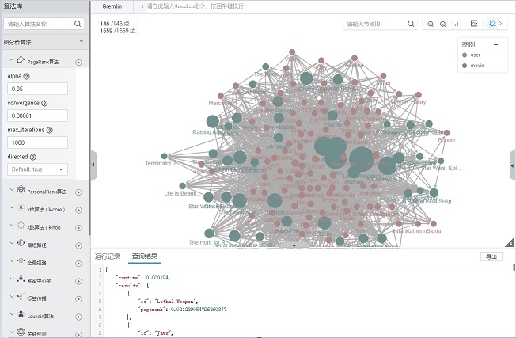

# 访问图引擎编辑器

## 操作场景

您可以通过图引擎编辑器对图进行分析和查询。其内置丰富的算法，供不同领域客户在不同场景使用；兼容Gremlin查询语言，支持开放的API接口。简单易用，让零基础用户快速上手。

## 操作步骤

1.  在图引擎服务管理控制台，选择“图管理“。
2.  在“图管理“页面，选择需要访问的图，单击“操作“列的“访问“。
3.  图引擎编辑器页面如[图1](#fig1567410497529)所示。您可以在编辑器页面对图数据进行分析。

    **图 1**  图引擎编辑器  
    

