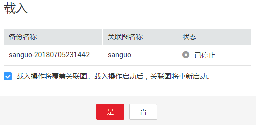

# 载入图

## 操作场景

如果当前编辑的图数据存在问题，需要获取之前备份的数据进行分析时，您可以将备份数据载入，以恢复图数据。

## 操作步骤

1.  登录图引擎服务管理控制台。
2.  在左侧导航栏选择“备份管理“。
3.  在“备份管理“页面，选择备份数据对应行，在“操作“列单击“载入“。
4.  在“载入“页面，确定载入的备份数据信息，勾选“载入操作将覆盖关联图。载入操作启动后，关联图将重新启动。“，单击“是“。

    **图 1**  载入数据  
    

5.  页面提示载入成功后，您可以在“图管理“页面，访问关联图，获取载入后的数据。

